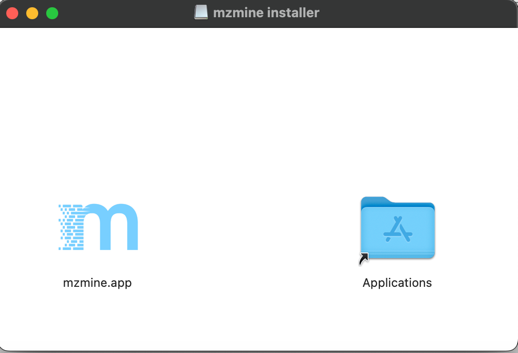
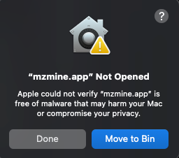
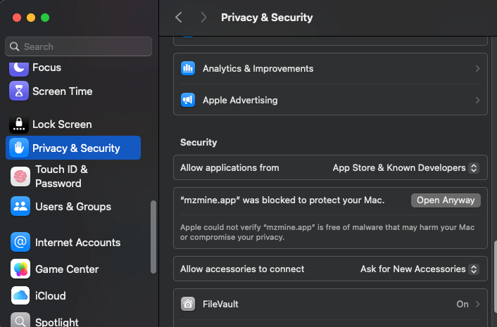
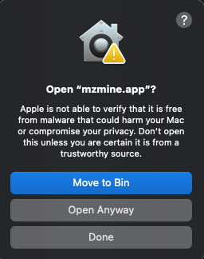
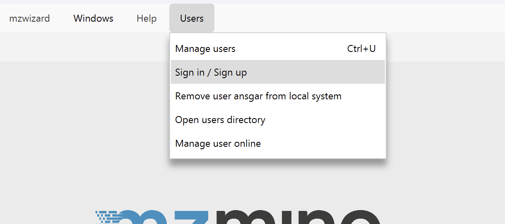
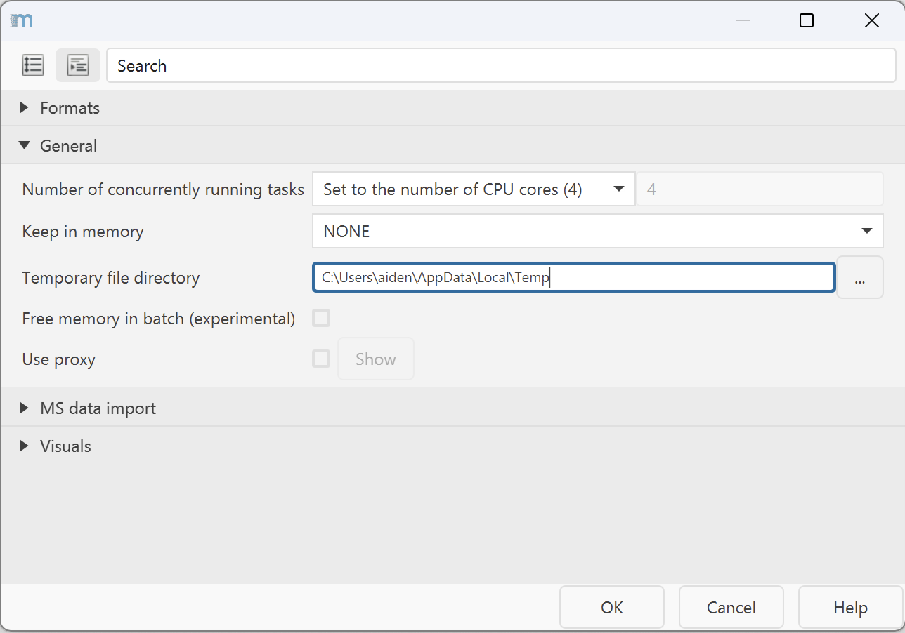
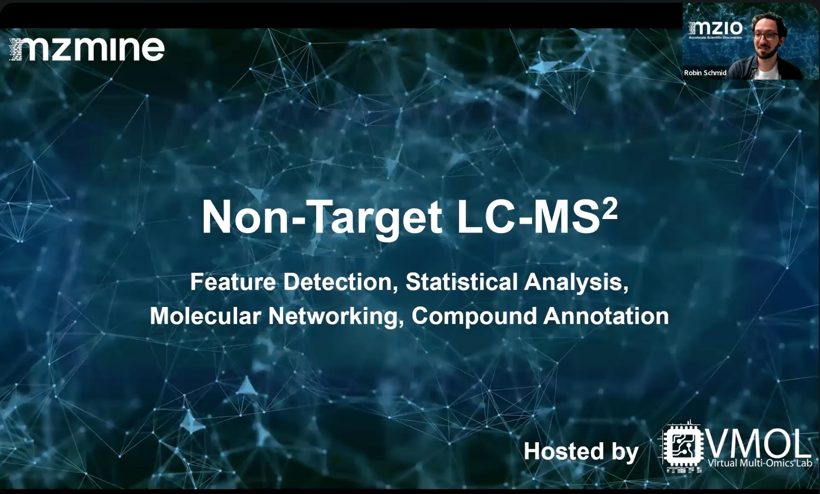

# Getting Started

## Download

Download mzmine portable versions or installers from GitHub:

[https://github.com/mzmine/mzmine/releases/latest](https://github.com/mzmine/mzmine/releases/latest)

## Install

mzmine should work on Windows, macOS, and Linux using either the installers or the portable versions. There are **NO** further requirements as mzmine packages a specific Java Virtual Machine. This means the local Java installation has **no** impact on mzmine. Windows and macOS users might be warned that mzmine is not signed or from a trusted source and have to click run anyway. 

Before creating your first project, we recommend to [set the preferences](#set-user-preferences).
### Installation on macOS
Download the latest version of the mzmine_macOS_installer_academia.dmg. Double click to start installation and drag and drop mzmine.app into the Applications folder.



Select "replace" to override older versions. First time starting mzmine may trigger a warning "mzmine.app" Not Opened on macOS 15 or later.



To open mzmine, go to System Settings, scroll down to Privacy & Security, and click on "Open Anyway" next to the message "mzmine.app" was blocked to protect your Mac.



A new message pops up. Click again on "Open Anyway" and enter your macOS password.



This procedure only has to be done once. Now, mzmine can be started like other applications. 

### Installation on Linux

Download the latest version, install mzmine, login, and run mzmine. See mzmine [command-line interface](commandline_tool.md) as a reference.  
```bash
# with gh (github) installed, download of latest .deb installer is quite easy
# gh auth login
# sudo apt install gh
# gh release download --repo mzmine/mzmine --pattern "mzmine*.deb"

# or find installer at https://github.com/mzmine/mzmine/releases/latest 
wget https://github.com/mzmine/mzmine/releases/download/text-action-release/mzmine_4.3.1_amd64.deb

# create required dir and install mzmine
sudo mkdir -p /usr/share/desktop-directories/
sudo apt install mzmine*.deb

# potential dependencies that may be required 
# sudo apt-get install xdg-utils
# sudo apt-get install libgl1
# sudo apt-get install libgtk-3-0
# sudo apt-get install libxtst6

# run mzmine and print help. also check -login-console -batch
/opt/mzmine/bin/mzmine -help
```

## Sign in / Sign up 

Open the **Users/User management** to sign in to an existing user or sign up for a free user account ([more details](services/users.md)).


## Set User Preferences

Before creating your first project, we recommend setting up some things.

1. Set a temporary file directory. Go to _Project_ → _Set preferences_ → _Temporary file directory_.
   This requires a restart to take effect.
    2. We recommend setting the directory to an SSD with enough space for fast processing and
       visualizations.
    3. On Windows, old temporary files are deleted when a new session is started.
       

2. mzmine 2  and mzmine 3 projects cannot be imported due to changes in the data structure.
3. mzmine 2  and mzmine 3 batch files cannot be imported due to parameter optimizations.

You can get familiar with the new GUI here: [Main window overview](main-window-overview.md)

## Start processing 

As a quick start you can use the [mzwizard](wizard.md) in the main menu or directly on the landing page. 

A good starting point is watching this [mzmine video tutorial on YouTube](https://www.youtube.com/watch?v=UnqVtZngzl0&list=PL0JAF-4UFc8NgyAOQhTKI9GZvSBcxe1AD).


A quick insight to data processing workflows can be found
here:
- [LC-MS workflow](workflows/lcmsworkflow/lcms-workflow.md)
- [LC-IMS-IMS workflow](workflows/imsworkflow/ion-mobility-data-processing-workflow.md)
- [Imaging workflows](workflows/imagingworkflow/imaging-workflow.md)

## Running mzmine

mzmine provides a user-friendly graphical user interface (GUI) that facilitates data exploration, batch optimization, and results validation. If the batch processing is optimized and the goal is to solely produce the output files without the need for a GUI, we recommend [running mzmine as a command-line tool](commandline_tool.md). 


{{ git_page_authors }}
