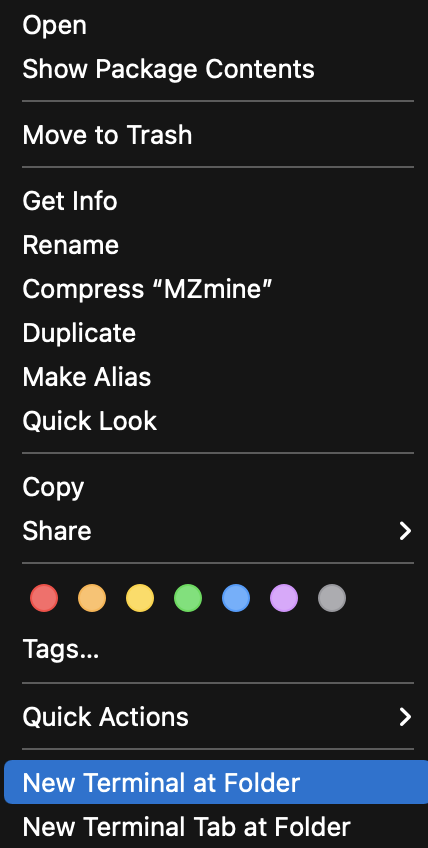

# Getting Started

## Download

Download mzmine portable versions or installers from GitHub:

[https://github.com/mzmine/mzmine3/releases/latest](https://github.com/mzmine/mzmine3/releases/latest)

## Install

mzmine should work on Windows, macOS, and Linux using either the installers or the portable versions. There are **NO** further requirements as MZmine packages a specific Java Virtual Machine. This means the local Java installation has **no** impact on MZmine. Windows users might be warned that MZmine is not signed or from a trusted source and have to click run anyways. 

Before creating your first project, we recommend to [set the preferences](#set-user-preferences). 

## Sign in / Sign up for a free user account

Open the **Users/User management** to sign in to an existing user or sign up for a free user account ([more details](services/users.md)). 


## Set User Preferences

Before creating your first project, we recommend setting up some things.

1. Set a temporary file directory. Go to _Project_ → _Set preferences_ → _Temporary file directory_.
   This requires a restart to take effect.
    2. We recommend setting the directory to an SSD with enough space for fast processing and
       visualizations.
    3. On Windows, old temporary files are deleted when a new session is started.
2. MZmine 2 projects cannot be imported due to changes in the data structure.
3. MZmine 2 batch files cannot be imported due to parameter optimizations.

You can get familiar with the new GUI here: [Main window overview](main-window-overview.md)

## Start processing 

An excellent place to start would be [mzmine video tutorials on YouTube](https://www.youtube.com/@mzmineproject/playlists).

A quick insight to data processing workflows can be found
here: [LC-MS workflow](workflows/lcmsworkflow/lcms-workflow.md)
or [LC-IMS-IMS workflow](workflows/imsworkflow/ion-mobility-data-processing-workflow.md)

You can also check out the new processing wizard under [Processing wizard](wizard.md) in the main menu. 

## Running mzmine

mzmine provides a user-friendly graphical user interface (GUI) that facilitates data exploration, batch optimization, and results validation. If the batch processing is optimized and the goal is to solely produce the output files without the need for GUI, we recommend [running MZmine as a command-line tool](commandline_tool.md). 


## Older MZmine versions on macOS

Currently, MZmine 3 lacks a signature for macOS. While we are working on this, user can allow MZmine
in the macOS Gatekeeper protection by running the following command in the terminal from the
Applications folder.

- Download MZmine and click the MZmine.dmg installer - Drag and drop MZmine into the Applications
  folder
- Open the Applciations folder, right click (CTRL click) anywhere, e.g., on the MZmine icon, and
  choose "New Terminal at folder" from the context menu
- Run the provided command to tell macOS to trust the installed version of MZmine. The terminal
  directory has to be the Applications folder. (Depending on the actual folder use or omit the `../`
  to jump to the parent directory).
- Approve command with user password
- Start MZmine

```
sudo xattr -cr ../MZmine.app

# if this fails try
# the app will appear in the security preferences and you will be able to choose the "Open anyway" option
sudo xattr -d com.apple.quarantine /Applications/MZmine.app
```

{: style="height:150px"} {: style="width:150px"}

The Terminal does not output any log or message.


Before creating your first project, we recommend to [set the preferences](#set-user-preferences).


{{ git_page_authors }}
