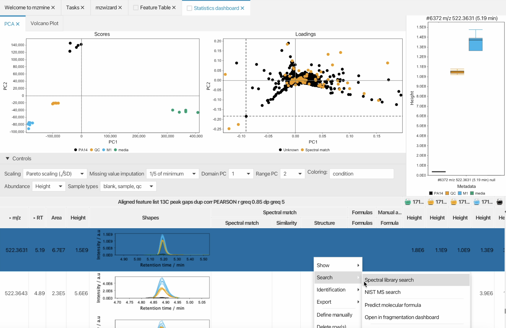
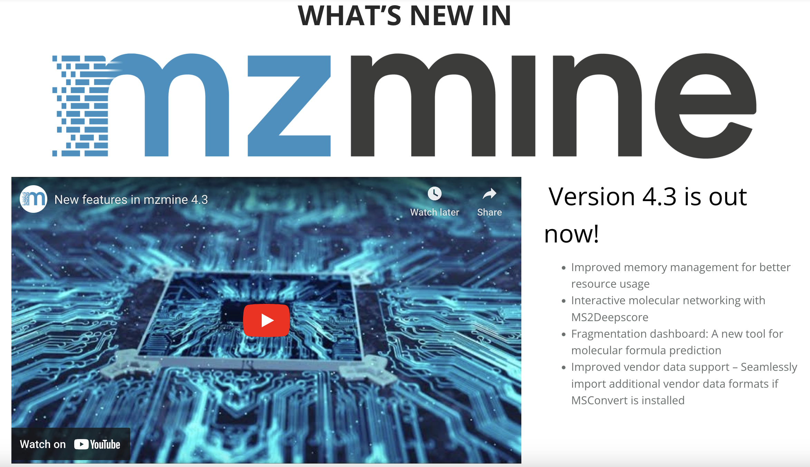

# Welcome to the mzmine documentation!

mzmine is an open-source and platform-independent software for mass spectrometry (MS) data
processing and visualization. The workflow is optimised to allow processing of large-scale mass
spectrometry studies.
mzmine supports multiple raw data formats, including open formats such as mzML and several
vendor-specific file types.
Data from various instrumental setups, such as LC-MS, LC-IMS-MS, GC-MS,
and even MALDI-(IMS-)-MS is supported.
Interactive visualization tools allow you to seamlessly
survey both raw data and processed results.
mzmine allows you to transform your spectral raw data into meaningful feature lists and offers
compound annotation approaches by spectral library
matching, exact mass searches, rule based lipid annotation, and formula prediction.
Furthermore, mzmine allows generation of custom spectral libraries.

!!! info
    
    When using mzmine, please cite the corresponding paper:  Robin Schmid, Steffen Heuckeroth, Ansgar Korf et al. Integrative analysis of multimodal mass spectrometry data in MZmine 3. Nature Biotechnology (2023), [doi:10.1038/s41587-023-01690-2](https://www.nature.com/articles/s41587-023-01690-2).

## Want to get started with mzmine?

Check out our **[getting started](getting_started.md)** page or **[mzmine video tutorials on YouTube](https://www.youtube.com/watch?v=UnqVtZngzl0&list=PL7kvpfzg8JkVGjhiGty5p-IDXgP9APx3b&index=1)** and [other videos](https://www.youtube.com/watch?v=jUHd3Sj7x0M&list=PL7kvpfzg8JkV7XKBUUX0xxOJimiK1VCOg).

 
---

## mzmine news

Check out latest **[mzmine news](https://mzio.io/mzmine-news/)**.

---

## History of mzmine

MZmine 3 was developed as a community effort, lead by Robin Schmid, Steffen Heuckeroth, Ansgar Korf and Tomas Pluskal.
It introduced a redesigned [GUI](main-window-overview.md), a completely new data structure which provided
the flexibility to process any type of mass spectrometry data. This included LC-MS, GC-MS and MS-imaging and introduced ion mobility support
(see [LC-IM-MS data visualization](visualization_modules/ims_raw_data_overview/IM-data-visualisation.md)
and [feature detection](workflows/imsworkflow/ion-mobility-data-processing-workflow.md)).
Finally, significant effort was devoted to trace memory issues and bottlenecks, resulting in an
unprecedented processing performance and scalability.

<!-- markdown-link-check-disable -->

Since the introduction of MZmine 2 in 2010, the project has matured into a community-driven, highly
collaborative platform and its functions continue to expand based on the users' needs and feedbacks.
This has also enabled the tight integration of the mzmine ecosystem with popular third-party
software for MS data analysis, such as
the [SIRIUS](https://bio.informatik.uni-jena.de/software/sirius/) suite for _in-silico_ metabolite
annotation, the [GNPS](https://gnps.ucsd.edu/ProteoSAFe/static/gnps-splash.jsp?redirect=auth)
platform with Ion Identity Molecular Networking, the [MetaboAnalyst](https://www.metaboanalyst.ca/)
web app for univariate and multivariate statistical analysis, _etc._

<!-- markdown-link-check-enable -->

Such great progress was made possible by the invaluable contribution of
many [developers](https://github.com/mzmine/mzmine3/graphs/contributors) from research labs
distributed all over the world!

---

## About this documentation

Here you can find documentation for both processing and visualization modules in mzmine. Moreover,
data processing pipelines for untargeted [LC-MS](workflows/lcmsworkflow/lcms-workflow.md)
and [LC-IMS-MS](workflows/imsworkflow/ion-mobility-data-processing-workflow.md) feature detection as well as [MS-Imaging](workflows/imagingworkflow/imaging-workflow.md) are described and general recommendations are given.

---

## How to contribute

The mzmine community is always welcoming new developers and contributions! You can contribute by
improving existing modules or even adding new featurs in mzmine! Please, check out our
brief [tutorial](http://mzmine.github.io/development.html).

You can also contribute to this wiki and help new users to get started with mzmine!
See [here](contribute.md) how to contribute to the documentation.

{{ git_page_authors }}
