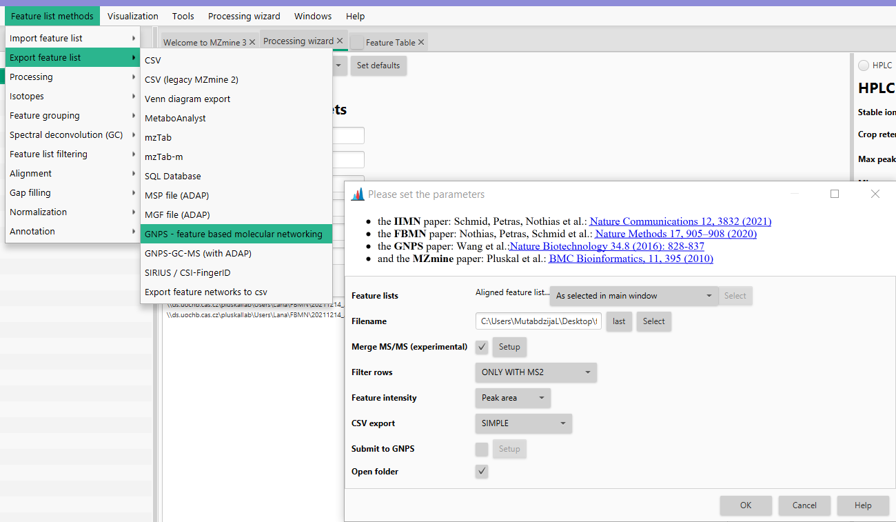
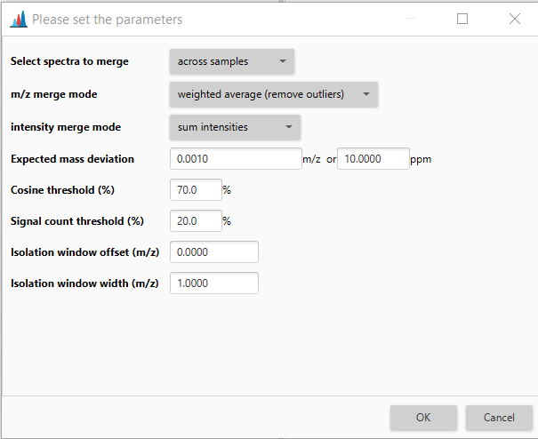

# GNPS export

The **GNPS export** is found under **Feature list methods → Export feature lists → GNPS - feature based molecular networking.**

Using this module, the user can export the feature list needed for the manual submission to GNPS' feature based molecular networking (GNPS FBMN) or directly submit the job to the GNPS platform from MZmine. In both cases, two files are created: 
    1. Quantification table (CSV file) which contains the features and their associated information (e.g retention time, peak area or peak height).
    2. MS/MS spectral summary (.MGF file) which contains representative MS/MS spectra for the rows in the feature list. 

### Parameters

#### Filename
Name to be given to the output files (.MGF and .CSV). In this field, the user can either write the path where they want to save the file, or click "select", navigate into the desired output folder, write the output name in the "file name" field and click save. Once that is done, the path should be visible in the Filename field in the GNPS export module.

#### Merge MS/MS (experimental)
If checked, high quality MS/MS spectra that correspond to one feature are merged, instead of exporting only the most intense MS/MS spectra.

##### Additional setup options:

##### Select spectra to merge
The users can select to merge the MS/MS spectra:
1.across samples, which will merge all MS/MS spectra that belong to the same feature, and as such is the most convenient option.
2.same sample, which will merge MS/MS spectra for the same feature within one sample, and can be used if the user is not confident about the alignment algorithm.
3.consecutive scans, which will merge MS/MS spectra if they are triggered in a row.

##### m/z merge mode
This option allows you to select the way to merge the fragments' m/z values associated with a similar precursor value.
"Most intense" will always pick the m/z of the best feature, which is a very safe and conservative option. However, "weighted average (remove outliers)" will often have better result. 

##### Intensity merge mode
Options on how to merge the intensity values of features from different spectra with similar mass.
"Sum intensities" is a convenient option that will increase the intensities of feature that occur consistently in many fragment scans. However, this will make intensities between merged and unmerged spectra incomparable. Use "max intensity" if you want to preserve intensity values.

##### Expected mass deviation
Expected mass deviation between different spectra of the same feature of your measurement in ppm (parts per million) or Da(larger value is used). We reccommend to use a rather large values, e.g. 10ppm for Orbitrap, 15 ppm for Q-ToF, 100 ppm for QQQ.

##### Cosine treshold
Treshold of cosine similarity between spectra that needs to be met in order for two spectra to be merged. In case they have different collision energies, cosine treshold should be set to 0%, since different collision energies will result in different fragmentation pattern.

##### Signal count treshold 
After merging the spectra, signals that occur in less than the user specified % of the merged spectra will be removed.
 
##### Isolation window offset (m/z)
Isolation window offset from the precursor m/z.

##### Isolation window width (m/z)
Width of the isolation window (left and right).  

#### Filter rows
In the final output files, the user can select to export all the rows without any filters applied, rows only with MS/MS spectra, rows with MS/MS and Ion Identity (it gives MS/MS and the adduct information) and rows with MS/MS or Ion Identity. Normally, for FBMN you want to retain features with MS/MS spectra.

#### Feature intensity
The user can either select peak area or peak height which will then be displayed in the quantification table.

#### CSV export
The user can choose between simple, comprehensive or all. Difference is in the amount of information that is present in the quantification table. 
Generally, "simple" can be used for the FBMN. 

#### Submit to GNPS
In case the user has a GNPS acccount, upon checking this option, it is possible to directly submit the job to GNPS for FBMN. The password is sent without encryption (until the server has moved to its final location with https).
The input files uploaded to GNPS with the "Submit to GNPS" option are not saved on your GNPS user account. These files are deleted on monthly basis, which prevent future cloning of the job and retrieval of the files. Use the "standard" interface of the FBMN for persistant jobs and more options.

#### Open folder
Opens the export folder.

