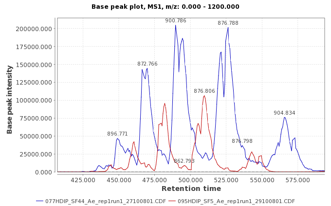
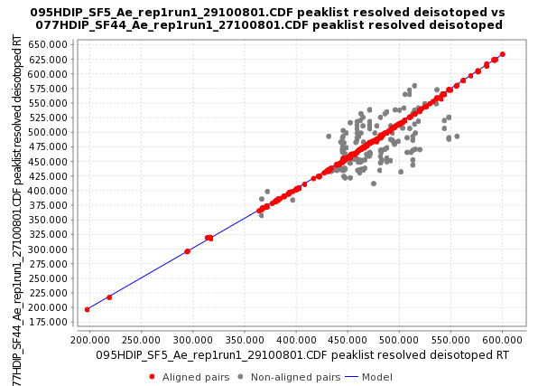

# **RANSAC peak list aligner**

## **Description**

:material-menu-open: **Feature list methods → Alignment → RANSAC aligner**

This method is an extension of the **Join aligner** method.

The alignment of each sample is done against a **master peak list**, which is taken from the first sample in the first round and from the average of all aligned peak lists in every round. 

It corrects any linear or non-linear deviation in the retention time of the chromatograms by creating a model of this deviation.

This picture shows an example of two samples with a non-linear deviation in the retention time:

The **"deviation" model** for the retention time is created by taking some corresponding points from the peak list of two samples using the RANSAC algorithm (<a>http://en.wikipedia.org/wiki/RANSAC</a>) and using a non-linear regression method to fit the model.

This picture shows a preview of the model with the red dots representing the aligned peaks taken using RANSAC algorithm, and the blue line represents the fitted model using a non-linear regression.

Using this model, the algorithm can predict the shift in the retention time along all the peak list and use the match score function, used also in **Join Align** algorithm, to match the peaks. 

This score is calculated based on the mass and retention time of each peak and ranges of tolerance stipulated in the parameter setup dialog.

## **Parameters**

**Feature list name**

The name of the new aligned feature list.

**m/z tolerance**

This value sets the range, in terms of m/z, to verify for possible peak rows to be aligned. Maximum allowed m/z difference.

**RT tolerance**

This value sets the range, in terms of retention time, to create the model using RANSAC and non-linear regression algorithm. Maximum allowed retention time difference.

**RT tolerance after correction**

This value sets the range, in terms of retention time, to verify for possible peak rows to be aligned. Maximum allowed retention time difference.

**RANSAC Iterations**

Maximum number of iterations allowed in the algorithm to find the right model consistent in all the pairs of aligned peaks. 

:material-lightbulb: When the value is 0, the number of iterations (k) will be estimate automatically.

**Minimum Number of Points**

% of points required to consider the model valid (d).

**Threshold value**

Threshold value (minutes) for determining when a data point fits a model (t).

[//]: # (TODO Check if the value is indeed in minutes)

**Linear model**

This option should be selected only if the model has to be linear.

:warning: Please, remember that when the shift in the retention time between the peaks in the samples is not constant the model shape is nonlinear, and this parameter should not be selected. 

### **Setting optimal parameters**

The three first parameters (m/z tolerance, RT tolerance after the correction and RT tolerance) define **2 bi-dimensional windows** with the same "altitude" (m/z tolerance) and different "longitude" (RT tolerances). 

**The first window** (m/z tolerance - RT tolerance after the correction) sets the space where the matching peak should be present, and **the second window** (m/z tolerance - RT tolerance) sets the total space where RANSAC algorithm will be applied. 

- So, **"RT tolerance"** should be as big as the maximum deviation in the retention time along all the chromatogram, and **"RT tolerance after the correction"** can be more flexible and depends on the complexity of the data. 

   If the data contains few peaks and the separation is good, the window can be bigger than "RT tolerance" window. It will improve the recall without including mistakes. This parameter should not change too much the final results.

- RANSAC is a non-deterministic algorithm, and the probability to find a good result increases with the **number of iterations**. If the user sets "0 iterations" into the parameter "RANSAC iterations" the algorithm will automatically set the optimum number of iterations depending on the number of data points. 

    :warning: In the case that there is a big number of data points it is better to limit this parameter even though the result could be non-optimal. The preview module can help in setting this parameter.

- The parameter **"Minimum number of points"** should be an estimation of the proportion of the data points inside the model. It is important not to get models composed by few data points which do not correspond to the real model. All the models which contain less proportion of data points won't be taken into account by RANSAC algorithm.

- **Threshold** value represents the width of the model and depends on the nature of the data. If this parameter is too big, it can lead to deviation of the model. 

    The preview module can help to set the optimal value.

- The choice of **model** depends on whether the deviation in the retention time can be considered linear or not in the data. 

   If the deviation in the retention time is linear, a simple linear regression will be used to fit the model.