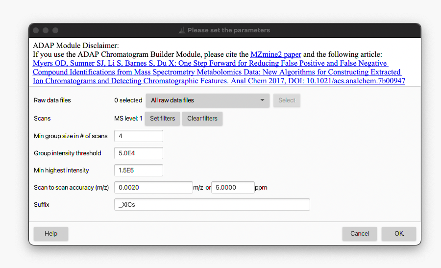

# **ADAP chromatogram builder**
The _ADAP chromatogram builder_ module is one of the LC-MS feature detection algorithms provided by MZmine 3. The module essentially builds an [EIC](../../terminology/general-terminology.md#extracted-ion-chromatogram) for each _m/z_ value that was detected over a minum number of consecutive scans in the LC-MS run.
Each data file is processed individually. The [mass list](../../terminology/general-terminology.md#mass-list) associated to each MS1 scan (see [Mass detection](../featdet_mass_detection/mass-detection.md) module) are taken as input and [feature list](../../terminology/general-terminology.md#feature-list) is returned as output. Since mass lists must be, the _Mass detection_ module must be run first.

The _ADAP chromatogram builder_ algorithm operates as follow. The MS1 spectra in the LC-MS are processed individually following a "chronological order" (_i.e._ increasing RT). Only MS1 scans are processed. The [masses](../../terminology/general-terminology.md#masses-and features) detected in each MS1 spectrum (_i.e._ the mass list) are first sorted in order of decreasing intensity and the processing starts from the most intense mass. Since no EICs have yet been created, a new EIC is initialized with and associated to the corresponding _m/z_ value. The same is repeated for all the masses in MS1 scan and a set of EICs is created (constituting the _feature list_). The processing proceeds with the second MS1 scan in the LC-MS run. Each mass is checked to determine if it "belongs" to an existing EIC based on its _m/z_ and the user-defined tolerance (_i.e._ "Scan to scan accuracy (m/z)" parameter). If a matching EIC is found, a new data point is added to the EIC. Whenever a data point is added, the average of the EIC’s _m/z_ values is recalculated and the EIC-associated _m/z_ updated. If no matching EIC is found, a new EIC is inizialized. When no new data point can be added to an EIC, the latter is terminated. The same is repeated for all the MS1 scans in the LC-MS run. When all the MS1 scans have been processed, the so-built set of EICs is checked according to the user-defined parameters (_i.e._ minimum number of data points and intensity). The EICs matching the requirements are retained in the feature list, whereas the rest are discarded. The so-built EICs can then be deconvoluted into individual features by one of the deconvolution algorithms provided by MZmine 3 (_e.g._ [Local mimimum resolver](../featdet_resolver_local_minimum/local-minimum-resolver.md) module).

---
## Parameters settings
:material-menu-open: Feature detection → LC-MS → ADAP chromatogram builder

**Raw data files**: To-do 

**Scans**: The scan selection parameter specifies the scans that shall be processed for feature detection.
Usually, setting the ms level to 1 is sufficient. If a calibration segment is present, it can be cut
out via the retention time filter in the scan selection.

**Min group size in # of scans**: minimum number of consecutive MS1 scans where a _m/z_ must be detected with a non-zero intensity in order for the corresponding EICs to be considered valid and retained in the feature list. The expeceted minimum number of data points essentially depends on the chromatographic conditions (_e.g._ HPLC vs UHPLC) and the used mass spectrometer's acquisition rate (a.k.a. scan speed). Usually, no less than 4-5 should be set

**Group intensity threshold**: Specifies a minimum intensity that the number specified by [min group size](#min-group-size-in-number-of-scans) have to exceed. In this example, the intensity in
at least 5 scans must be above 5E2.

**Min highest intensity**: The highest point of a potential EIC must exceed this value.

**Scan to scan accuracy (m/z)**: The **m/z tolerance** specifies the scan-to-scan tolerance for EICs. This tolerance depends on the mass accuracy and resolution of the instrument. Usually, a good starting point for optimisations are 0.005 and 5-10 ppm for Orbitrap instruments, while 0.005 and 10-15 ppm can be used for TOF
instruments.

**Suffix**: To-do

Min time span
Minimum time span over which the same ion must be observed in order to be recognized as a chromatogram. The optimal value depends on the chromatography system setup. The best way to set this parameter is by studying the raw data and determining what is the typical time span of chromatographic peaks.
Min height
Minimum intensity of the highest data point in the chromatogram. If chromatogram height is below this level, it is discarded.
m/z tolerance
Maximum m/z difference of data points in consecutive scans in order to be connected to the same chromatogram.
Suffix
The resulting chromatogram will be named file name + suffix
The resulting chromatograms can be opened in the peak list table visualizer using a double-click:

The mass tolerance may be set both in _m/z_ and ppm.
