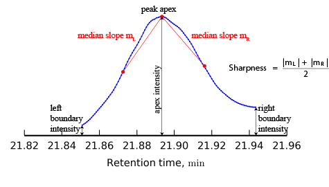

# **Spectral deconvolution: Hierarchical Clustering**

:construction: This module is being updated, which might affect its functionality

## **Description**

:material-menu-open: **Feature list methods → Spectral deconvolution (GC) → Hierarchical clustering**

This ADAP-based method finds analytes by combining similar features into clusters and using their intensities to construct fragmentation mass spectra. 

The following steps are performed:

- All EIC peaks are clustered based on proximity of their retention times. The user can specify minimum distance between clusters, minimum number of peaks forming a cluster, and minimum cluster intensity. If preview is selected, the top right plot displays the result of the clustering with dots corresponding to EIC peaks and colors corresponding to different clusters. 
- In each cluster, EIC peaks are filtered based on their sharpness and on their elution profiles. All EIC peaks with sharpness below minimum sharpness are filtered out. 
- If "**Find shared peaks**" is selected, then shared peaks are filtered out as well. A user can specify minimum edge-to-height ratio and minimum delta-to-height ratio that are used in determining shared peaks. 
- EIC peaks that have passed the filtering step, are clustered based on their elution profiles. The user can specify shape-similarity tolerance: small tolerance corresponds to large number of clusters, while large tolerance corresponds to a small number of clusters. If a preview is selected, the result of the clustering is shown on the bottom-right plot. 
- Each cluster corresponds to one analyte. Among all EIC peaks in the cluster, a model peak is chosen to represent the elution profile of the analyte. 
    - If **Choise of Model Peak based on Sharpness** is selected, then the EIC peak with the highest sharpness in the cluster is selected to be a model peak. 
    - If **Choice of Model Peak based on Intensity** is selected, then the EIC peak of the highest intensity is selected to be a model peak. 
    - If **Choice of Model Peak based on M/z value** is selected, then the EIC peak with the highest m/z value in the cluster is selected to be a model peak.
- In order to build fragmentation spectra for analytes, each EIC peak is decomposed into a linear combination of the model peaks with the weighting coefficients obtained by solving an optimization problem. 
- These coefficients and m/z value of the EIC peak contribute to the fragmentation spectra of the corresponding analytes.

### **Method definitions**

**Sharpness**

In order to find sharpness, the medians of the slopes of the lines connecting the peak apex to its other data points are calculated on each side of the peak apex. The sharpness is defined as the average of the two medians.

**Shared peak**

EIC peak is considered to be shared (i.e. produced by two co-eluting analytes) if at least one of the following conditions is satisfied:

- its elution profile has several local maxima
- its left boundary intensity divided by the apex intensity exceeds minimum edge-to-height ratio
- its right boundary intensity divided by the apex intensity exceeds minimum edge-to-height ratio
- the absolute difference between its boundary intensities divided by the apex intensity exceeds by minimum delta-to-height ratio

## **References**

!!! quote " "

    1. Pluskal, T., Castillo, S., Villar-Briones, A. & Oresic, M. MZmine 2: Modular framework for processing, visualizing, and analyzing mass spectrometry-based molecular profile data. _BMC Bioinformatics_ (2010). DOI: <a>10.1186/1471-2105-11-395</a>
    2. Smirnov A, Jia W, Walker D, Jones D, Du X: ADAP-GC 3.2: Graphical Software Tool for Efficient Spectral Deconvolution of Gas Cromatography—High-Resolution Mass Spectrometry Metabolomics Data. J. Proteome Res 2017, DOI: <a>10.1021/acs.jproteome.7b00633</a>

## **Parameters**

#### **Min cluster distance (min)**

Minimum distance between any two retention-time clusters.

#### **Min cluster size**

Minimum number of peaks in a cluster.

#### **Min cluster intensity**

Minimum intensity of the highest peak in a cluster.

#### **Find shared peaks**

If selected, shared peaks are determined and do not participate in the second clustering.

#### **Min edge-to-height ratio**

Minimum value of a boundary intensity divided by the apex intensity of EIC peak that is considered to be shared.

#### **Min delta-to-height ratio**

Minimum value of the absolute difference of the boundary intensities divided by the apex intensity of EIC peak that is considered to be shared.

#### **Min sharpness**

Minimum sharpness of EIC peak that can participate in the second clustering.

#### **Shape-similarity tolerance (0..90)**

Tolerance is used in the second clustering based on the similarity of peaks' elution profiles: small tolerance corresponds to large number of clusters; large tolerance corresponds to a small number of clusters.

#### **Choice of Model Peak based on**

In each cluster, a model peak is chosen. 

- If Sharpness is used, then EIC peak with the highest sharpness in the cluster is chosen to be a model peak. 
- If Intensity is used, then EIC peak of the highest intensity in the cluster is chosen to be a model peak. 
- If M/z value is used, then EIC peak with the highest m/z value in the cluster is chosen to be a model peak.

#### **Exclude m/z-values**

_Optional parameter_ 

Optionally, the user can specify a list of deprecated m/z values such that EIC peaks with those m/z value could not be chosen as model peaks. It is possible to specify single m/z values as well as ranges of m/z values. 
For example: 1-50, 73, 100.

#### **Suffix**

String to add to feature list name as a suffix.

**Remove original feature list**

If checked, original feature list will be removed.

{{ git_page_authors }}