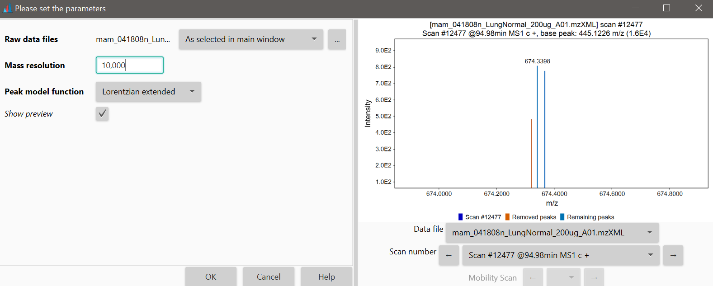

# **FTMS shoulder peak filter**

## **Description**

:warning: This module should be used after mass detection step is performed.

:material-menu-open: **Raw data methods → Mass detection → FTMS shoulder peak filter**

Raw data obtained from FTMS (Fourier Transform Mass Spectrometer) instruments often contains false signals around high-intensity m/z peaks, called **"shoulder peaks"**. These signals are residues of the Fourier Transform function and their intensity is usually below 5% of the main (true) m/z peak. 

The FTMS shoulder peaks filter attempts to remove these false signals. Ions in the mass lists (generated previously by the Mass detector module) are processed in the order of decreasing intensity. A peak model (shape) is built around each ion peak using given function and resolution, and those m/z peaks which fall below the model are considered to be shoulder peaks and therefore are removed. 

The method offers three theoretical peak models.

Example of running the shoulder peaks filter on LTQ Orbitrap data:

## **Parameters**

#### **Mass resolution of the data**

Defines the width of the model, which should be equal to the estimated resolution of the peaks in the raw data. Mass resolution is the dimensionless ratio of the mass of the peak divided by its width. Peak width is taken as the full width at half maximum intensity (FWHM).

  

#### **Peak model function**

Defines the shape of the model function, as described below. Peaks under the curve of this peak model will be removed.

## **Available peak models**
### **Gaussian peak model**

The Gaussian peak model is a characteristic symmetric "bell shape curve" that quickly falls off towards plus/minus infinity, described by the following formula.

\[f(x)=ae^-\frac{(x-b)^2}{2c^2}\]

The parameter "a" is the height of the curve's peak, "b" is the position of the center of the peak, and "c" controls the width of the "bell".

  

### **Lorentzian peak model**

The Lorentzian function (Cauchy-Lorentz distribution) is used for this model. The Lorentzian peak model is described by the following formula:

\(f(x;x_0,\gamma,I)=\frac{I}{\biggl[1+\frac{x-x_0}{\gamma}^2\biggr]}
=I\biggl[\frac{\gamma^2}{(x-x_0)^2+\gamma^2}\biggr]\)

Where "x0" is the location parameter, specifying the location of the peak of the distribution, and "y" is the scale parameter which specifies the width of the peak.

  

### **Lorentzian extended peak model**

This model uses the same mathematical formula as the Lorentzian peak model, but the lower part of the model (below 5% of the intensity) is extended. The width of the peak below 5% intensity is calculated from another Lorentzian peak with 5% of the resolution of the main peak.

  

