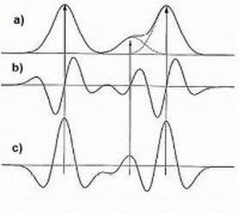
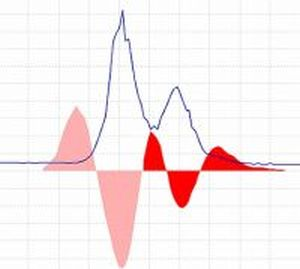

# **Savitzky-Golay resolver**

## **Description**

:material-menu-open: **Feature detection → Chromatogram resolving → Savitzky Golay resolver**

This method uses the **Savitzky-Golay polynomial** [[1]](#references) to calculate the smoothed second-derivative of the chromatogram's intensities. 

The following figure (left) presents the shape of a) a Gaussian peak, b) the first derivative, and c) the second derivative. 

The figure on the right side shows how the signal (blue line) may be divided into individual chromatographic peaks by observing the second derivative.

## **References**

!!! quote " "

     1. A. Savitzky and M. J. E. Golay, Anal. Chem., 36, 1627 (1964). DOI: <a>10.1021/ac60214a047</a>

## **Parameters**

**Suffix**

This string is added to feature list name as suffix

**Original feature list**

Defines the processing. 
Standard is to KEEP the original feature list and create a new processed list. 

REMOVE saves memory. 

PROCESS IN PLACE is an advanced option to process directly in the feature list and reduce memory consumption more - this might come with side effects, apply with caution.

**MS/MS scan pairing**

Set MS/MS scan pairing parameters. For more details see [MS2 scan pairing](..//featdet_ms2_scan_pairing/ms2_scan_pairing.md)

**Min peak height**

Minimum acceptable feature height (absolute intensity)

**Peak duration range**

Range of acceptable feature durations

**Derivative threshold level**

Minimum acceptable intensity in the second derivative for feature recognition

**Min # of data points**

Minimum number of data points on a feature.

{{ git_page_authors }}