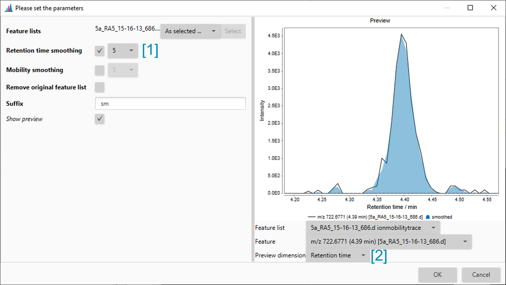

# **Smoothing**

## **Description**

:warning: This module should be used after feature detection step is performed.

:material-menu-open: **Feature detection → Smoothing**

Smoothing is an optional feature that is used depending on the noisiness of the data. Smoothing allows to approximate a peak shape to the "ideal" shape defined by the target function of the used algorithm.

In MZmine 3, two algorithms can be used for smoothing:

- Savitzky-Golay,
- and Loess smoothing.

### **Savitzky-Golay smoothing**

This smoothing method is also implemented in **Raw data methods → Raw data filtering → Scan by scan filtering**. Its brief description is available in that [section](../filter_raw_data/filter-scan-by-scan.md#savitzky-golay-filter). For more details see [[1](#references)].

:material-lightbulb: The benefit of Savitzky–Golay is its efficiency. Due to a fixed user-defined window size and equal spacing, the weights are also fixed. As a result, the local fit need be solved only once.

### **Loess smoothing**

**LOESS (locally weighted smoothing)** or **LOWESS (Locally Weighted Scatterplot Smoothing)** is a non-parametric method that relies only on a smoothing parameter value and the degree of polynomial without a predefined function. Each polynomial is fitted locally depending on the defined bandwidth. 

More details on LOESS smoothing can be found in [[2](#references)].

:material-lightbulb: Can be slightly slower than the Savitzky-Golay algorithm (due to the repeated local fitting) but also a bit more precise.

## References

!!! quote " "

    1. A. Savitzky and M. J. E. Golay, Anal. Chem., 36, 1627 (1964). DOI: 10.1021/ac60214a047

    2.  William S. Cleveland & Susan J. Devlin (1988) Locally Weighted Regression: An Approach to Regression Analysis by Local Fitting, Journal of the American Statistical Association, 83:403, 596-610, DOI: 10.1080/01621459.1988.10478639
## **Parameters**

#### **Feature lists**

Feature lists that the module will take as an input.

#### **Smoothing algorithm**

Choose if Savitzky-Golay or LOESS smoothing will be used.

##### **Savitzky-Golay additional parameters**

**Retention time smoothing**

Number of data point to smooth in retention time dimension. Defines window size and coefficients used in smoothing.

**Mobility smoothing**

Number of data point to smooth in mobility dimension.

##### **LOESS additional parameters**

**Retention time width (scans)**

Number of scans to smooth in retention time dimension. 
Used to calculate a fraction of source points, which is subsequently used to calculate LOESS "bandwidth". "Bandwidth or "smoothing parameter" determines how much of the data is used to fit each local polynomial.

:material-lightbulb: Higher values of smoothing parameter lead to the smoother output but simultaneously to a larger loss of information.

**Mobility width (scans)**

Number of data point to smooth in mobility dimension. The points about previous parameter apply here as well.

## **Optimizing smoothing parameters using the preview**

### **Retention time dimension**

Smoothing chromatograms is optional.
The necessity of smoothing in RT dimension is determined by the noisiness of chromatographic peaks. These can be influenced by the overall spray stability, instrument accumulation times, transfer efficiency and many more.

The number of data points to be smoothed in rt dimension can be set at [1] (see image below). Note that the correct
preview dimension is selected at [2] (see image below).

For large batch modes, the **Remove original feature list** parameter should be selected. While parameters are being optimised, this is not recommended, because removing a feature list cannot be undone.

### Mobility dimension

After resolving a feature in RT dimension, the mobilograms will be recalculated from the raw data (the resolved ion mobility trace). Therefore, a smoothing step is necessary if the data requires it. The smoothing dialog is opened via **Feature detection → Smoothing**

Select to smooth the mobility dimension [1] and select it as preview dimension [2]. The filter with depends on the number of spectra acquired in the observed mobility range. Usually, a value between 5 and 15 should be appropriate.

{{ git_page_authors }}
