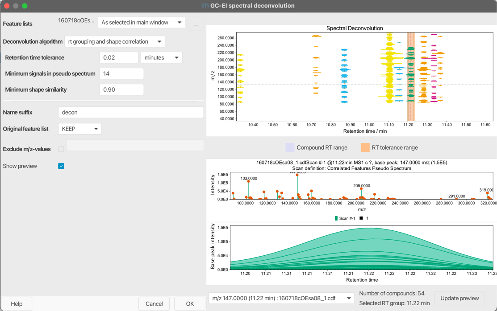

# GC-EI spectral deconvolution 

## Description
:material-menu-open: Feature list methods → Spectral deconvolution (GC) → GC-EI spectral deconvolution

This ADAP inspired method groups resolved features into pseudo spectra, representing deconvoluted GC-EI spectra. It clusters features based on retention time and other parameters to construct fragmentation spectra for analytes.

The following steps are performed depending on the selected Deconvolution algorithm:

### Deconvolution algorithm: rt grouping and shape correlation 
All features are clustered based on their retention times. The user can specify the maximum retention time tolerance and the minimum number of signals in a pseudo spectrum.
Features are initially sorted by intensity.
Each feature is then assigned to potential clusters within the specified retention time tolerance. If a feature falls within the RT range of multiple clusters, shape correlation is performed to determine the most suitable cluster. Clusters that do not meet the minimum number of signals are removed.
### Deconvolution algorithm: hierarchical clustering
All features are clustered based on their retention times.
The user can specify the maximum retention time tolerance and the minimum number of signals in a pseudo spectrum. Features are initially sorted by intensity.
Each feature is placed in an initial cluster. Clusters are then paired based on their RT distance, and a priority queue is used to manage these pairs.
If all features in a cluster pair fall within the specified RT tolerance, the clusters are merged. This process continues until no more clusters can be merged. Clusters that do not meet the minimum number of signals are removed.

Also read:
References
!!! quote " "
 
Smirnov A, Jia W, Walker D, Jones D, Du X: ADAP-GC 3.2: Graphical Software Tool for Efficient Spectral Deconvolution of Gas Chromatography—High-Resolution Mass Spectrometry Metabolomics Data. J. Proteome Res 2017, DOI: <a>10.1021/acs.jproteome.7b00633</a>

## Parameters

## Deconvolution algorithm
### rt grouping and shape correlation
#### Retention Time Tolerance (min)
Maximum allowed difference between two retention time values for them to be clustered together.

#### Minimum Number of Signals
Minimum number of deconvoluted signals in a pseudo spectrum.

### hierarchical clustering
#### Retention Time Tolerance (min)
Maximum allowed difference between two retention time values for them to be clustered together.

#### Minimum Number of Signals
Minimum number of deconvoluted signals in a pseudo spectrum.

## Exclude m/z-values
Optional parameter
Optionally, the user can specify a list of deprecated m/z values such that EIC peaks with those m/z values could not be chosen as model peaks. It is possible to specify single m/z values as well as ranges of m/z values.
For example: 1-50, 73, 100.

## Suffix
String to add to feature list name as a suffix.

## Remove original feature list
If checked, the original feature list will be removed.

## Preview
The preview dialog displays the deconvolution results for the selected feature list. Click on "Update preview" to create the plots. The upper plot displays grouped features by color as compounds. The grey area around a selected group represents the RT range of the most abundant feature. The orange area indicates the RT tolerance set in the parameters. The plots at the bottom show pseudo spectra based on the grouped features and an overlay of the grouped features for quality control. At the bottom, the user can select a grouped compound based on the representative feature. Next to the combo box is a short summary of the selected feature and the total number of groups.

{{ git_page_authors }}
