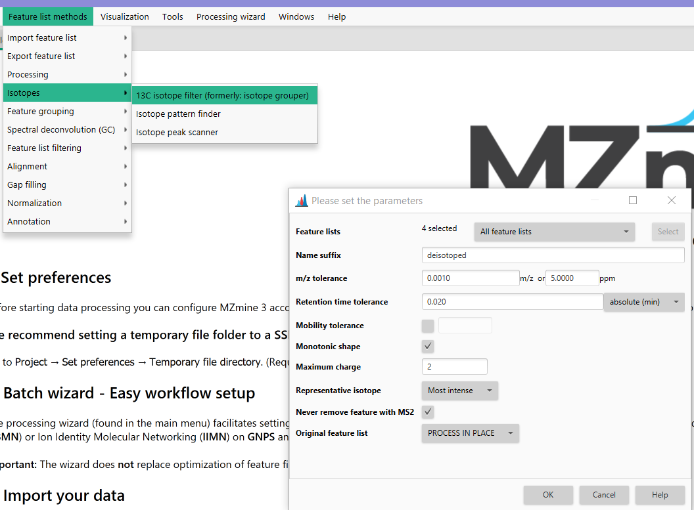

# ^13^C isotope filter (Isotope grouper)

The **^13^C isotope filter** is found under **Feature list methods → Isotopes → ^13^ isotope filter (formerly: isotope grouper).**

### Parameters

#### Name suffix
Suffix to be added to feature list name.

#### m/z tolerance
Maximum allowed difference between two features' m/z values in order for them to be considered the same. The value is specified both as absolute tolerance (in m/z) and relative tolerance (in ppm). The tolerance range is calculated using maximum of the absolute and relative tolerances.

#### Retention time tolerance
Maximum allowed difference between the retention time values of two features that will taken into account when performing the ^13^ isotope filtering .

#### Mobility tolerance
If enabled(and mobility dimension was recorded), isotopic peaks will only be grouped if they fit the given tolerance.

#### Monotonic shape
If true, then monotonically decreasing height of isotope pattern is required.This is usually the case for ^13^C isotope pattern of small molecules.

#### Maximum charge
Maximum charge to consider for detecting the isotope patterns. The charge state with the maximum number of detected isotope features will be used.

#### Never remove feature with MS2
If checked, all features with MS2 are retained without applying any further filters on them. 

#### Original feature lists
The input feature list can either be kept, removed, or directly filtered (PROCESS IN PLACE). This allows for more control over memory usage. Where available, in place processing is the most performant.
