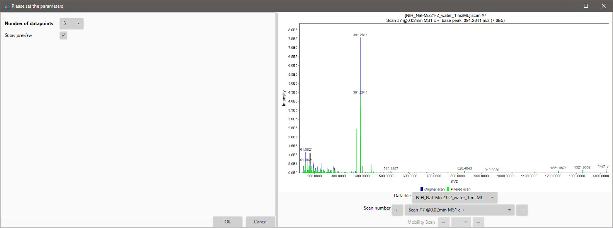

# **Scan by scan filtering**

## **Description**

:material-menu-open: **Raw data methods → Raw data filtering → Scan by scan filtering**

This module can be used to preprocess data in each scan using various filters.

The preview shows the superposed spectra of the scan before and after the Savitzky-Golay filter is applied.

## **Filters**

### **Mean filter**

For each data point, the filter assigns to it the intensity average of all the datapoints inside the user defined window. The window is centered in the mass value of this data point.

#### **Parameters**

##### **Window length**

One-sided length of the m/z smoothing window.

### **Savitzky Golay filter**

The Savitzky–Golay smoothing filter was first described in 1964 by Abraham Savitzky and Marcel J. E. Golay.

The Savitzky–Golay method essentially performs a **local polynomial regression (of degree k)** on a series of values (of at least k+1 points which are treated as being equally spaced in the series) to determine the smoothed value for each point. 

<http://en.wikipedia.org/wiki/Savitzky-Golay_smoothing_filter>

#### **Parameters**

##### **Number of datapoints**

This number can be 5, 7, 9, 11, 13 or 15.

### **Resampling filter**

Each scan is divide in m/z bins whose length is defined by the user in the parameters. The mass of the new data point will be in the middle of each m/z bin's space. Its intensity is the average of the intensity of all the data points inside the bin.

#### **Parameters**

##### **m/z bin length**

The length of m/z bin.

### **Round resampling filter**

All data points in each scan is shifted to the nearest rounded integer (**ion number**). The mass of the new data point will be on the rounded value. 

If several data points are competing for the same rounded value / mass, the new data point's intensity is the average of all the competing data points. 

Unless **"Sum duplicate intensities"** is checked, leading to a single new data point with intensity equal to the sum of the intensities of all the competing data points. 

:warning: If the scan is not centroided, its spectrum is first turned into centroid using a default "local maxima" algorithm, then the same algorithm as described above is applied.

#### **Parameters**

##### **Sum duplicate intensities**

Sums ions count (intensity) of m/z peaks competing for being rounded at same m/z unit. If unchecked, the intensities are averaged rather than summed.

##### **Remove zero intensity m/z peaks**

Clear all scans spectra from m/z peaks with intensity equal to zero.

[//]: # (TODO Add the images for each filter)