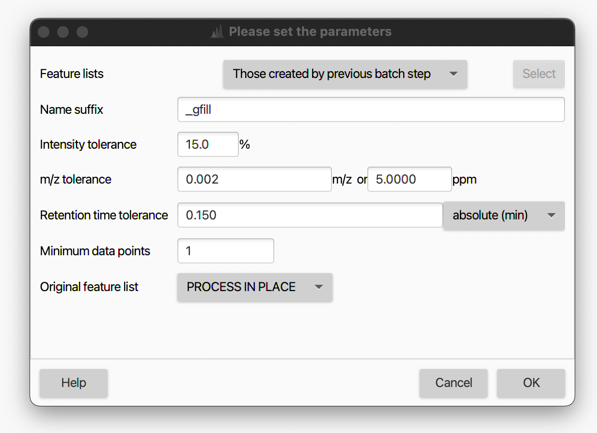

# **Gap-filling**

When a peak (_i.e._ _feature_) feature cannot be identified/quantified in certain sample will be assigned a zero-intensity value during the feature alingment (see [here](../join_aligner/join_aligner.md) for more details). This produces '_gaps_' in the aligned feature table, commonly referred to as [_missing values_](../../terminology/general-terminology.md#missing-values).

FIGURE ALIGNED TABLE

However, there is a number of occasions where, due to suboptimal feature detection, a _missing value_ is assigned even tough the peak is actually present. In particular, three main reason can be identified: 
- Peak intensity below the _minimum abundance_ threshold (e.g. LINK A PARAMETER). The peak will be not detected even though there is a peak, and it can be gap-filled for the alignment process if the peak having the same RT and m/z is detected in other samples.
- Reason 2. Peak discarded in a previous processing step. Peaks filtered out due to low peak intensity
- Reason 3. Misalingment.
- Reason 4. Inaccurate peak detection and deconvolution of co-eluting compounds.

The gap-filling module (_i.e._ _'Peak finder' algorithm_) aims at reducing false missing values and 'fill the _gaps_' by going back to the original raw data and re-integrating the peak area where the peak is expected. This approch is sometimes reffered to as '_back-filling'_.

---COMPLETE FROM HERE---
The algorithm examines each feature in the aligned table individually, takes the RT window associated to the examined features and looks for appropriate peak features in that window. If requirements are met (e.g. REQUIREMENTS) the peak integrated and the retrieved peak area used to XXX, this filling the gap.

and reconstructs omitted chromatographic peaks in “empty” samples by scanning the m/z and retention time region of LC–MS spectra corresponding to the detected peaks in other samples.

- EXPLAIN COLOUR CODE IN MZMINE. Filled gaps are shown with a yellow icon. There may still be some gaps in which no evidence for the peak was found. 

DANGER DUPLICATED. Some features in the dataset showed duplicates which appear during peak recognition and alignment of samples. The duplicates falsify the exploratory analysis of data and were removed in MZmine.

The gap-filled feature table can now be used in downstream data analysis

---
## Parameters settings
:material-menu-open: Feature list methods → Gap filling → Peak finder

#### **Name suffix**
String added as suffix when creating the new gap-filled feature table.

#### **Intensity tolerance**
Maximum allowed deviations from expected peak shape of a peak in chromatographic direction

#### **_m/z_ tolerance**
Maximum allowed difference between the feature _m/z_ and the _m/z_ in the raw data.

The tolerance can be specified as absolute tolerance (in _m/z_), relative tolerance (in ppm), or both. When both are specified, the tolerance range is calculated using the maximum between the absolute and relative tolerances.

#### **Retention time tolerance**
Maximum allowed difference between XXX

#### **Minimum data points**
Only fill gaps with features with minimum number of data points. Usually lower number of data points are used.

#### **Original feature lists**
Keep or remove the input feature list(s). The _PROCESS IN PLACE_ option directly filter the input feature list and performs better in terms of memory usage; therefore, it is recommended over _REMOVE_, when available.

