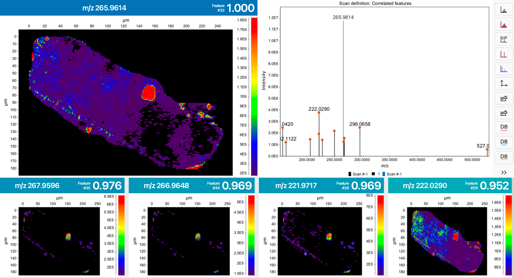
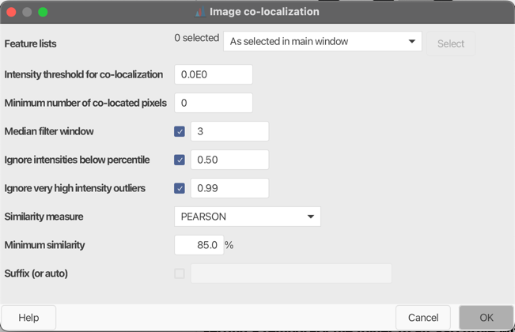

# Image co-localization

## Description

:material-menu-open: Feature list methods → Feature grouping → Image co-localization.

This module systematically identifies and groups images sharing similar spatial ion distributions. The user can choose between various similarity measure (e.g. pearson correlation) and can apply different filtering options before image comparison.

## Parameters

#### Feature Lists
Select feature list

#### Intensity threshold for co-localization
This intensity threshold is used to filter data points (pixel) before image co-localization.

#### Minimum number of co-located pixels
Minimum number of locations (pixels) that must be co-located.

#### Median filter window
Optional: Smooth over pixels to reduce noise and remove outliers, 3 ist recommended.

#### Ignore intensities below percentile
Optional: Only consider intensities above the selected percentile, 0.5 is recommended.

#### Ignore very high intensity outliers
Optional: Only consider values below the selected percentile, 0.99 is recommended.

!!! tip

    Using the optional parameters Median filter window, Ignore intesities below percentile, and Ignore very high intensity outliers may result in better co-localization results.

#### Measure
Select similarity measure.

#### Min image correlation
"Minimum percentage for image similarity to be considered co-located."

#### Suffix (or auto)
Suffix to be added to the feature list name.

{{ git_page_authors }}