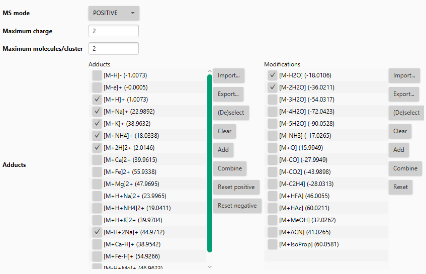

# Ion identity networking

:material-menu-open: **Feature list methods → Feature grouping → Ion identity networking**

Annotates grouped features (same retention time + optionally, feature shape and height correlation)
as ion adducts, in
source fragments, and multimers. Also used as input to
the [Ion Identity Molecular Networking workflow]
(https://ccms-ucsd.github.io/GNPSDocumentation/fbmn-iin/) on GNPS. Searches all feature pairs
against an ion library
for each possible combination. Great in combination with
the [Molecular Networking](../../group_spectral_net/molecular_networking.md) module that calculates
fragmentation pattern similarities in mzmine and allows for interactive visualization.

!!! warning
Apply [metaCorrelate](../metacorr/metacorr.md) before running this module

## Recommended citations

<!-- markdown-link-check-disable -->
!!! info
When using this modules, please consider citing the corresponding publication(s): 
Schmid, R., Petras, D., Nothias, LF. et al. Ion identity molecular networking for mass
spectrometry-based metabolomics in the GNPS environment. Nat Commun 12, 3832 (
2021). https://doi.org/10.1038/s41467-021-23953-9

    Schmid R., Heuckeroth S., Korf A., et al. Integrative analysis of multimodal mass spectrometry data in MZmine 3, In Review (2023)

---
<!-- markdown-link-check-enable -->

## Parameters

#### _m/z_ tolerance

Intra sample _m/z_ tolerance describes the difference between two ions of the same molecule at the
same retention
time. This tolerance is usually very small and depends on the mass resolution. Orbitrap instruments
for example 3 ppm.

#### Check

- **ONE FEATURE**: Only one feature needs to match (_m/z_ difference within one sample)
- **ALL FEATURES**: All features need to match (_m/z_ difference within ALL samples)
- **AVERAGE**: Matches the _m/z_ difference of average values

#### Min height

Minimum height of features to consider. Leave at 0 to use all features that passed the feature
detection workflow
criteria.

#### Ion identity library

Defines the ions to search. When two features, applied with two ions, result in the same neutral
mass - an
annotation is made. New ions can be defined. Adducts (left) and neutral modifications (right) are
combined to create
the final ion library.

!!! tip
This step should only focus on the main ions that are typically detected in the MS method.
Later the _Add more ion identities_ module can add strange ions to existing networks.

#### Annotation refinement _(optional)_

Annotation refinement is optional but should be applied to finalize ion identities, after all
subsequent optional
steps of _Add more ion identities_ steps.

**Parameters:**

- _Minimum size (optional)_: Only retain ion networks with at least n ions (often 3). The more ions
  the higher the
  confidence in the annotation.
- _Delete small networks without major ion (optional)_: Major ions are defined as M+H, M+Na, M+NH4,
  M-H2O+H
- _Delete smaller networks: Link threshold (optional)_: Important parameter to only keep the best
  annotation, when
  this annotation is supported by n-1 ions (network size n).
- _Delete networks without monomer (optional)_: Only keep a network if at least one is M+... and not
  a multimer like
  2M, 3M...
- _Delete rows without ion id_: Remove all rows from the feature list that have no ion identity
  annotation

---

{{ git_page_authors }}
