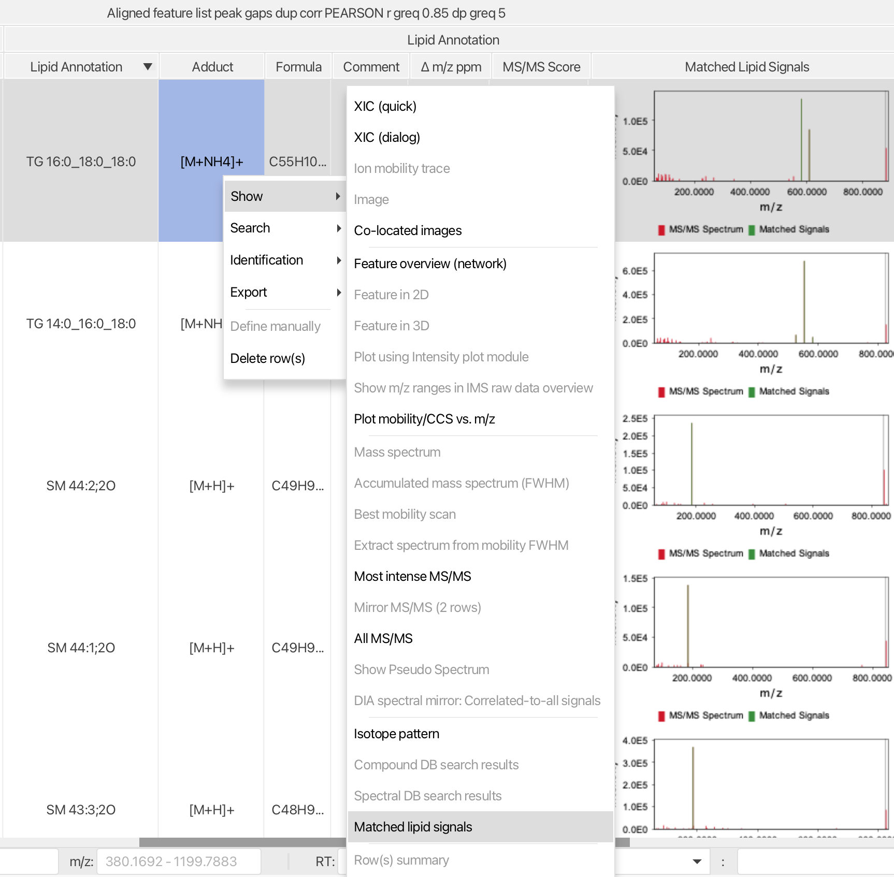

# Lipid Annotation

## Description

:material-menu-open: Feature list methods → Annotation → Search spectra → Lipid annotation

This module uses lipid class and ion notation specific fragmentation rules to annotate lipids in the feature lists. Lipids will be annotated based on accurate m/z on MS1 level and matched lipid fragments in MS2 spectra. 
This rule-based annotation approach follows Lipidomics Standards Initiative guidelines and uses the latest shorthand notation for lipid structure from mass spectrometry to avoid over-annotation. Annotations on species and molecular species level are currently supported. 

!!! tip
    
    Lipid annotations are directly added to the feature list. Matched fragments can be quickly evaluated. To validate the annotation quality right click on the annotated feature list row and select Matched lipid signals.
:material-menu-open: Show → Matched lipid signals

## Recommended citations

!!! info
    When using the Lipid annotation module consider reading and citing the original publication and the MZmine 3 publication.

    1. Korf, A., Jeck, V., Schmid, R., Helmer, P. O., & Hayen, H. (2019). Lipid Species Annotation at Double Bond Position Level with Custom Databases by Extension of the MZmine Open-Source Software Package. Analytical chemistry, 91(8), 5098-5105. doi:10.1021/acs.analchem.8b05493
    2. Schmid R., Heuckeroth S., Korf A., et al. Integrative analysis of multimodal mass spectrometry data in MZmine 3, Nature Biotechnology (2023), doi:10.1038/s41587-023-01690-2.

## Parameters

#### Lipid classes

This parameter lists all pre-configured lipid classes in MZmine. Each selected lipid class will be added to the search scope.  

#### Side chain parameters

Set the allowed min and max for chain length (number of carbons) and double bond equivalents (DBE) in a lipid chain. The number of chains is defined in the lipid class.
12 to 26 carbons and 0 to 6 DBEs is recommended as a starting point.
!!! warning

    Lipid chain variation highly depends on the analyzed sample.
!!! tip

    Odd chain lipid chains can be skipped by "Only search for even chain length to avoid false positive annotations.

#### m/z tolerance MS1 level

Enter m/z tolerance for exact mass matching on MS1 level. Lipids outside the m/z tolerance will not be matched.

#### Search for lipid class-specific fragments in MS/MS spectra

Activate this parameter to highly increase lipid annotation confidence.

!!! warning

    Mass detection on MS2 level needs to be performed first.

Set a mz tolerance for matching signals in MS2 spectra.
Set a Minimum MS/MS score to accept a lipid annotation. The score is the explained intensity [%] of all signals in MS/MS spectrum. Matches below the set score will be removed, except the optional parameter Keep unconfirmed annotations is selected.
Unconfirmed annotations will be marked with a comment in the feature list.

#### Search for custom lipid class

If selected, the user can add their own custom lipid class that will be added to the search scope. Click the Add... button or double-click on an already defined custom lipid class to start with the configuration. Configured custom classes can be exported and re-imported for further analysis.
!!! tip

    You want your lipid class preset in MZmine? Contribute to the code or contact the developers.

#### Advanced

#### Show database

By clicking the button "Show database" at the bottom of the window, the user can browse through a database table which holds the information of the created lipid database.

[//]: # (TODO Leave commented until bug is fixed)
[//]: # (All lipids are displayed in two Kendrick mass plots &#40;KMD CH2 left, KMD H right&#41;. Lipids that interfere in the selcted m/z window are marked yellow, isobaric lipids are marked red. The others are displayed green.)

[//]: # (TODO Add the plots)

## Results description

Peaks will be annotated as potential lipids by setting its peak identity. Always check for multiple assignments and compare the status with the database table and Kendrick plots! The comment holds information on the utilized ionization method, mass accuracy and MS/MS annotation. An MS/MS annotation will be added if MS/MS data was acquired and fragmentation information is listed in the database. More MS/MS data will be added in the future.

{{ git_page_authors }}