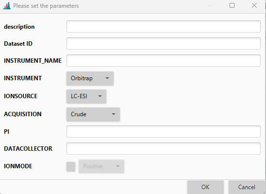
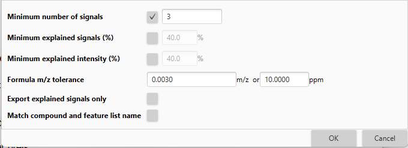

# **Feature list export modules**

This section describes general format export modules. For the description of export modules for the specific software, please, refer to [Data export to other software](data-exchange-with-other-software.md).

## **CSV**

### **Description**

:material-menu-open: **Feature list methods → Export feature list → CSV**

This module allows to export obtained feature lists to csv (comma-separated values) file format.

### **Parameters**

#### **Field separator**

Character(s) used to separate fields in the exported file. "," by default.

#### **Identification separator**

Character(s) used to separate multi object columns in the exported file. ";" by default.

#### **Remove empty columns**
_Optional parameter_

Removes empty columns during data export.

#### **Filter rows**

Allows user to export only those rows that have associated MS/MS data or are annotated. 

## **CSV (legacy MZmine 2)**

### **Description**

:material-menu-open: **Feature list methods → Export feature list → CSV (legacy MZmine 2)**

This module is a legacy module from MZmine2 and, similarly to the previously described module, exports the contents of the feature list(s) into a csv file, which can later be processed by MS Excel or other tools. The produced CSV files cannot be imported back to MZmine. Missing values such as heights and areas of undetected features are exported as 0.

### **Parameters**

#### **Filename**

Name of file where the exported data is saved

#### **Field separator**

Columns in the new CSV file will be separated by this character (coma by default)

#### **Export common elements**

Which row elements (such as row ID, row retention time, or best ion annotation) from the feature list will be exported 

#### **Export data file elements**

Which feature elements (such as feature status, name, or tailing factor) will be exported.

#### **Export quantitation results and other information**
_Optional parameter_

If checked, all feature-associated data will be exported.

#### **Identification separator**

Character to separate multiple identification results (if they are available) for a feature. 

#### **Filter rows**

Allows user to export only those rows that have associated MS/MS data or are annotated. 

## **Venn diagram export**

## **Description**

:material-menu-open: **Feature list methods → Export feature list → Venn diagram export**

Exports a feature list to a csv that can be plotted as a venn diagram by other software such as [VennDis](https://pubmed.ncbi.nlm.nih.gov/25545689/) or [VENNY](https://bioinfogp.cnb.csic.es/tools/venny/).

## **Parameters**

#### **Directory**

Choose a directory to export the feature list to.

#### **Export gap filled as detected**
_Optional parameter_

If checked, gap filled features will be exported as detected, otherwise they will be marked as undetected.

## **mzTab export**

### **Description**

:material-menu-open: **Feature list methods → Export feature list → mzTab**

This module exports the contents of the feature list into a mzTab file, which can later be processed by other tools.

### **Parameters**

#### **Feature lists**

Name of the feature list(s) to be exported.

#### **Filename**
Name of file where the exported data is saved.

#### **Include all peaks**
_Optional parameter_

If selected, the features with unknown identity will also be exported to the mzTab file.

## **mzTab-m export**

### **Description**

:material-menu-open: **Feature list methods → Export feature list → mzTab-m**

This module exports the contents of the feature list into a mzTab-m file, which can later be processed by other tools.

### **Parameters**

#### **Feature lists**

Name of the feature list(s) to be exported

#### **Filename**
Name of file where the exported data is saved

#### **Include all peaks**
_Optional parameter_

If selected, the features with unknown identity will also be exported to the mzTab file.

## **SQL export**

### **Description**

:material-menu-open: **Feature list methods → Export feature list → SQL database**

This module allows direct export of the feature lists into MySQL or PostgreSQL database servers. If you would like to use another database then please add its JDBC driver (jar file) to the MZmine lib/ folder.

### **Parameters**

#### **Feature lists**

Name of the feature list(s) to be exported

#### **JDBC connection string**

Identification of the database according to the JDBC standard. For example:

    jdbc:mysql://localhost/dbname?dbname=sqluser&password=sqluserpw

#### **Database table**

Name of the table, into which data will be exported.

#### **Export columns**

The mapping between the database table columns (“Table column”) and MZmine data types (“Export data type”). For some data types an additional value (“Export value”) must be specified, such as for the “Constant value” type.

#### **Export empty feature list**
_Optional parameter_

If selected, an empty feature list will be exported. All columns, other than raw data file and constants, will be assigned null values.

## **MSP Export**

### **Description**

:material-menu-open: **Feature list methods → Export feature list → MSP file (ADAP)**

This module exports fragmentation spectra of peaks in the feature list into **MSP** format file. In addition to the spectra, the following feature characteristics are saved into the file:

- Name
     Name of the peak as displayed in the peak list
- DB#
     Row number in the peak list
- RT 
     _Optional_
     Retention time of a feature
- ANOVA_P_VALUE (optional)
     P-value calculated by the module Data analysis -> One-way ANOVA Test
- Num Peaks
     Number of peaks in the spectrum 

### **Parameters**

#### **Feature lists**

Name of the feature list(s) to be exported

#### **Filename**
Name of file where the exported data is saved

#### **Add retention time**

If selected, each MSP record will contain feature's retention time.

#### **Add ANOVA p-value (if calculated)**

If selected, each MSP record will contain the One-way ANOVA p-value if such p-value is present

#### **Integer m/z**

If selected, fractional m/z values will be rounded to the closest integer, and a new intensity will be calculated based on the merging mode:

- Maximum: new intensity is the maximum of merged intensities,
- Sum: new intensity is the sum of merged intensities.

## **MGF Export**

### **Description**

:material-menu-open: **Feature list methods → Export feature list → MGF file (ADAP)**

This module exports fragmentation spectra of features in the feature list into **MGF (Mascot Generic Format)** format file. 

[//]: # (TODO check the additional feature characteristics info)
[//]: # (In addition to the spectra, the following feature characteristics are saved into the file:)

[//]: # ()
[//]: # (- FEATURE_ID )

[//]: # (     Row number in the peak list)

[//]: # (- PEPMASS)

[//]: # (     Mass of the peak. If each row in the peak list contains several peaks &#40;e.g. after performing alignment&#41;, the mass of the highest peak is chosen)

[//]: # (- RTINSECONDS)

[//]: # (     Retention time of the peak. If each row in the peak list contains several peaks, the average retention time is chosen)

[//]: # (- SCANS)

[//]: # (     The same as FEATURE_ID)

[//]: # (- MSLEVEL)

[//]: # (     Always equals 2)

[//]: # (- CHARGE)

[//]: # (     Always equals 1+)

### **Parameters**

#### **Feature lists**

Name of the feature list(s) to be exported

#### **Filename**
Name of file where the exported data is saved

#### **Representative m/z**

Choose the reprezentative m/z values of a cluster. The available options are:
- As in feature table,
- Highest m/z,
- Or maximum intensity.

#### **Fractional m/z values**
_Optional parameter_

If selected, fractional m/z values will be saved. If not, all fractional m/z values will be rounded to the closest integer.

!!! warning
     In case of rounding to integer, the corresponding features will be merged.

#### **Integer m/z**

When features are merged, the resulting elution profile is calculated by one of the following rules:
- Maximum. In the resulting elution profile, the intensity at retention time _t_ is the maximum of the intensities at _t_ across the merging elution profiles.
- Sum. In the resulting elution profile, the intensity at retention time _t_ is the sum of the intensities at _t_ for all merging elution profiles.

## **Export feature network to csv**

### **Description**

:material-menu-open: **Feature list methods → Export feature list → Export feature network to csv**

Export results from correlation/MS annotation as networks to csv.

### **Parameters**

#### **Filename**

Base file name of all edge files (Use {} to fill in the feature list name when exporting multiple feature lists at once).

#### **Export row relationships**
_Optional parameter_

Export all relationships of different rows to files. The relationships that can be exported include:
- MS1 feature correlation
- Ion identity network
- MS2 cosine similarity
- MS2 neutral loss cosine similarity
- MS2 modified cosine similarity (GNPS)

#### **Combine to one file**
_Optional parameter_

If chosen, all output is combined into one file. Otherwise, a separate file is exported per each relationship type.

#### **Export IIN edges**
_Optional parameter_

Export all edges of Ion Identity Networks (IIN).

#### **Export IIN relationship edges**
_Optional parameter_

Export relationships between Ion Identity Networks (IIN).

#### **Filter rows**

Limit the exported rows to those with MS/MS data and/or annotated rows. 

## **Spectral library batch generation**

### **Description**

:material-menu-open: **Feature list methods → Export feature list → Spectral library batch generation**

This module allows to generate spectral library using metadata sheet.

### **Parameters**

#### **Feature lists**

Name of the feature list(s) to be exported.

#### **Export file**
Name of a local library file where the exported data is saved.

#### **Export format**
File format for the export. Available options:
- MZmine json (**recommended**),
- And NIST msp.

#### **Metadata**
Metadata for all entries.

##### **Metadata setup**

In this dialog user can setup all dataset-related data, including the decription, ID (either from MassIVE, MetaboLights, or Metabolomic Workbench), specifications of the instrument, information on researchers involved in the dataset creation, and ion mode.

#### **m/z tolerance (merging)**
_Optional parameter_

The tolerance used to group signals during merging of spectra. If selected, spectra from different collision energies will be merged. 

#### **Handle chimeric spectra**
_Optional parameter_ 

Options to identify and handle chimeric spectra with multiple MS1 signals in the precursor ion selection.

##### **Handle chimeric spectra setup**

This dialog allows to set parameters for handling chimeric spectra. The spectrum detected as chimeric will be flagged if this option is chosen.

#### **Quality parameters**

Quality parameters for MS/MS spectra to be exported to the library.

##### **Quality parameters spectra setup**

The following dialog allows to set the criteria for the MS/MS export to the library, such as minimum number of signals, percentage of explained signals or intensity, etc.

