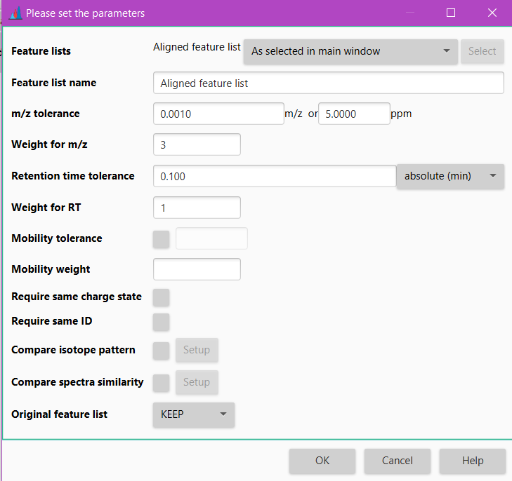

# Join aligner
This method aligns detected peaks in different samples through a match score. This score is calculated based on the mass
and retention time of each peak and ranges of tolerance stipulated in the parameter setup dialog.

The join aligner module is found under **Feature list methods → Alignment → Join aligner**.

#### Algorithm

The peak alignment algorithm uses:

1. a master list of peaks (L) against which every new sample (Sj) will be matched. When aligning peaks from 
multiple samples, the master list is initially set to the first sample, and subsequently it will be the combination
of samples aligned thus far, with the samples as the columns and the matching peaks as the rows.

2. for every row i in L, a two-dimensional window (where the window size is selected by the user), called Alignment window (AW) defining the ranges of m/z and RT and centered around the average of m/z and RT of all the individual peaks in the row; and

3. a score function to compute the similarity of peaks between L and the new sample Sj inside the alignment window. The score function computes the similarity based on the similarities in m/z, retention time, and optionally on identification, and isotope patterns between the peaks to be matched. The score is calculated as follows:
score = ((1 - MZdifference / MZtolerance) × MZweight) + ((1 - RTdifference / RTtolerance) × RTweight)

The algorithm works as follows. It iterates through the rows of L, and for each row, it looks for peaks within the alignment window in Sj that has to be aligned with L. A score is calculated for each possible match and the pair getting the best score will be aligned.

### Parameters

#### Feature list name
Name of the new aligned peak list.

#### m/z tolerance
 Maximum allowed difference between two m/z values in order for them to be considered the same and thus the peaks aligned. The value is specified both as absolute tolerance (in m/z) and relative tolerance (in ppm). 
 The tolerance range is calculated using maximum of the absolute and relative tolerances for possible peaks to be aligned. 

#### Weight for m/z
This is the assigned weight for m/z difference at the moment of match score calculation between peak rows, as can be seen in the aforementioned formula. Only in cases where there is a perfect match of m/z values, the score receives the complete m/z weight. 
Generally, higher weight is given to m/z values than to RT values. 

#### Retention time tolerance 
Maximum allowed difference between two retention times in order for them to be considered the same and thus peaks aligned.
Maximum RT difference can be defined either using absolute or relative value. 

#### Weight for RT
This is the assigned weight for RT difference at the moment of match score calculation between peak rows. 
Only in cases where there is a perfect match of RT values, the score receives the complete RT weight. 

#### Mobility tolerance
In case of IM data,the user can determine the mobility tolerance. If checked, this parameter specifies the tolerance range for matching the mobility values. 
 

#### Mobility weight
Score for perfectly matching mobility values. Only taken into account if "Mobility tolerance" is activated. Furthermore,
score calculation that is mentioned in the **Algorithm** is then modified to account for the mobility as well. Mobility tolerance and weight are accounted for
in the same manner as m/z and RT parameters.

#### Require same charge state
If checked, only rows having same charge can be aligned. 

#### Require same ID
If checked, only rows having same compound identities (or no identities) can be aligned.

#### Compare isotope pattern
If both peaks represent an isotope pattern, checking this box will add isotope pattern score to the match score calculation. Additionally, the user can set up **isotope m/z tolerance** which defines what isotopes would be considered same when comparing two isotopic patterns, **minimum absolute intensity** below which isotopes will be ignored and **minimum score** % between isotope patterns that has to be satisfied in order for the match to not be discarded.

#### Compare spectra similarity
Compare MS1 or MS2 scans similarity. Select the m/z tolerance, MS level and spectra similarity algorithm. 
Only features meeting this criteria will be aligned.  See [compare spectra similarity](spectra_similarity.md) for additional information.

#### Original feature list
The user can choose to either KEEP the original feature list and generate a new processed one, or REMOVE the original feature list with the processed one.
Generally, you would keep the original feature list, but opting for REMOVE will save memory.

