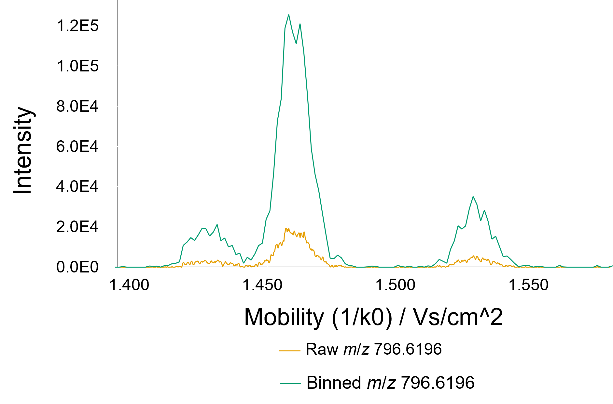

# **IMS Expander**

# **Description**

:material-menu-open: **Feature detection → LC-IMS-MS → IMS expander**.

The IMS expander searches for data points in mobility scans for existing features. 

:warning: This requires prior chromatogram building (see [Chromatogram builder](../../lc-ms_featdet/featdet_adap_chromatogram_builder/adap-chromatogram-builder.md) and resolving in retention time dimension (see [Resolving](../../featdet_resolver_local_minimum/local-minimum-resolver.md)).

### Parameters

#### m/z tolerance

If selected, a tolerance will be applied to the feature's detected m/z while searching for data
points in mobility dimension. Otherwise, the accepted m/z range is determined by the feature's m/z
distribution in accumulated frame spectra.  
**Recommended setting: selected, 0.003 m/z and 15 ppm**

#### Raw data instead of thresholded

Enables searching in mobility scan raw data instead of the thresholded (=mass detected) data. Only
possible for centroid raw data files.

#### Override default mobility bin width (scans)

If selected, the default number of binned mobility scans can be overriden. Useful for data with high
mobility resolution. 

### Binned mobilogram example

{{ git_page_authors }}