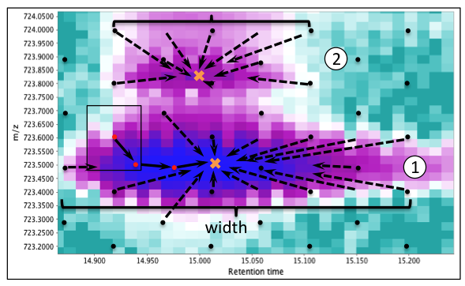

# **GridMass**

## **Description**

:material-menu-open: **Feature detection → LC-MS → GridMass**

GridMass is an algorithm to detect peaks analyzing 2D data. It directly generates a peak list, which can then be operated using the peak list methods.

### **Algorithm**

To detect the position and boundaries of masses, the GridMass algorithm first generates a grid of equally spaced probes covering the entire chromatographic area. A representative section is shown in the figure below.

+ Each probe (black dots in Figure) explores a rectangular region around it to find a local maximum. 

+ The probe location is moved to the local maxima to further search for a higher value. 

+ The procedure is performed until no higher values exist within the exploring rectangle. 

+ This local maximum is then defined as a **feature**, which contains information of the m/z, the time, and the intensity detected. 

A putative trajectory of a probe is shown in the figure. All probes converging to the same feature provide an estimation of its **boundaries**. 

Consequently, different features represent different masses. 

:material-lightbulb: This procedure is highly sensitive and specific for smooth surfaces. However, given that in real chromatographic data a certain level of noise and artifacts are present, in MZmine additional criteria (such as possibility to choose time windows, additional smoothing, etc.) were implemented.

A summary of the algorithm is as follows:

1. Ignore artifact spectra in time domain. In chromatography, it is typical to find a peak near the injection time, corresponding to metabolites that show no interaction with the column in the particular gradient. While this is not an artifact per se, given the myriad of signals present and the nature of the detector, the resulting peak is a strong source of artifacts that later affect analysis. To avoid this, the user may enter a list of time ranges to be ignored. The controlling parameter is ignore times whose format is time1-time2, time3-time4, … Alternatively, the user may crop these data before processing, for example using “Raw Data→Filtering→Data Set" and ignore setting this parameter. Therefore, this step is optional.
2. Generate equally spaced probes over the mass-time space.To generate the grid, the parameters used are m/z tolerance and minimum width. The gap in the m/z dimension between probes is set to m/z tolerance multiplied by 2 or minimum to 1e-6 and are intercalated between scans. The gap in the time dimension is calculated by time associated to scans, which is estimated by the minimum width divided by 4 (down to a minimum of 1 scan). 
3. Move each probe to corresponding local maximum until convergence.Each probe explores its surroundings (limited by the positions of other probes) to locate the highest intensity value, then after updating its position, it keeps exploring the surrounding until a local maximum is reached. To speed up the procedure, generate only interesting features above a certain level of noise, and limit the number of reported features, only intensities higher than minimum height threshold are considered. 
4. Generate features by merging probes with similar 2D positions.Many probes will reach the same maximum that must correspond to the same feature. In addition, experimental chromatographic data is noisy and non-smooth, which may generate local maxima very close to each other. Therefore, probes whose difference in m/z is lower than the m/z tolerance and whose difference in time is lower than minimum width are merged. Then, from all probes reaching the same maximum, the m/z assigned to the feature corresponds to the highest observed intensity. The width of the feature is estimated from the probes with the lowest and highest time. To form the peak and estimate its area, the highest value in each scan is used. 
5. Remove features whose width is out of a range.Features having large or very low width are likely to be artifacts. To avoid this, all features out within the range given by the parameters minimum width and maximum width (in minutes) are removed. 
6. Remove features of similar mass and high cumulative times.Chemical noise or large blurs are characterized by generating many features of similar mass, similar intensities, and separated by short times. To avoid these artifacts, we merge features whose m/z difference is lower than m/z tolerance and whose intensity ratio (higher/lower) is higher than an intensity similarity ratio parameter. Once merged, the removal implemented in step 5 is performed on merged features.

## **Parameters**

#### **Suffix**

Suffix to be added to peak list name.

#### **Minimum height**

Only intensities larger than this minimum are considered.

#### **m/z tolerance**

Maximum distance in m/z from the expected location of a peak.

#### **Min-max width time (min)**

Time range for a peak to be recognized as a 'mass'. The optimal value depends on the chromatography system setup. Check 2D raw data to determine typical time spans.

#### **Smoothing time (min)**

Time window used to smooth the signal before detection.

#### **Smoothing m/z**

m/z window used to smooth the signal before detection.

#### **False+: Intensity similarity ratio**

Ratio between features to be recognized as the same. This is highly useful to detect artifacts.

#### **False+: Ignore times**

Ranges of time to be ignored by the method. This can be avoided if the region is previously cleaned using the crop option. Format: timeA-timeB, timeC-timeD,...

{{ git_page_authors }}