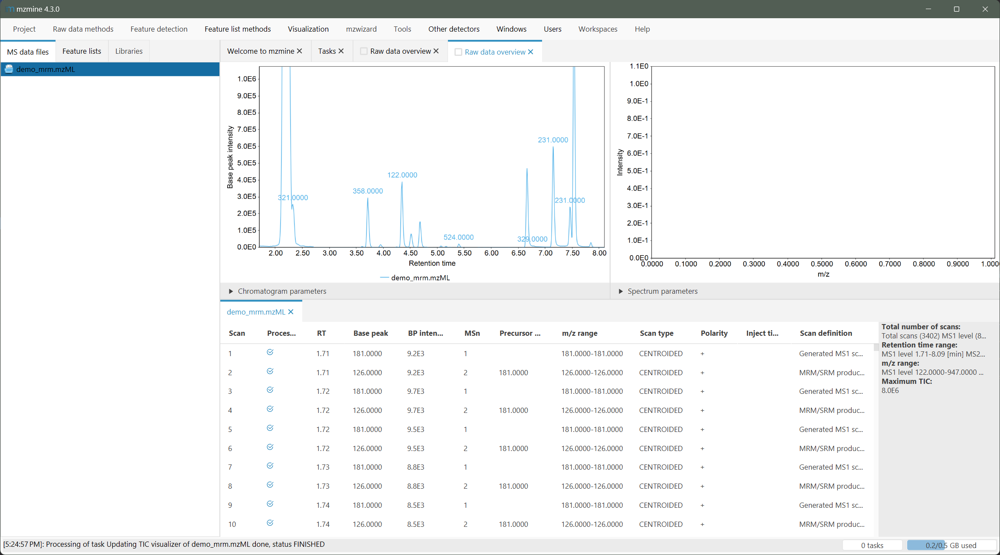
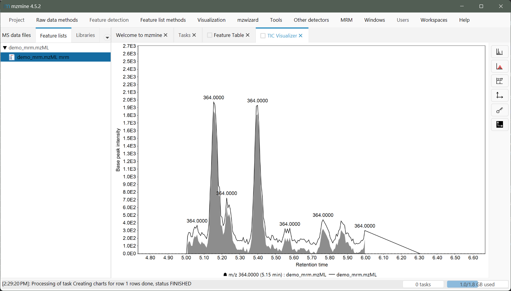

# MRM to scans

!!! warning
    To process multiple reaction monitoring (MRM) data, the MRM service of mzmine is required. This feature is
    included in the mzmine PRO subscription. Academic program and other users can reach out to inquire
    [access options](https://mzio.io/#contact).

:material-menu-open: **MRM → MRM to scans and chromatograms**

Since Triple-Quadrupole MRM or SRM workflows typically produce one or more transition chromatograms 
per compound instead of individual spectra, the data must be pre-processed to fit into the regular 
mzmine workflow. This is achieved by this module.

## Parameters
#### Raw data files
Select the raw data files that the MRM processing shall be applied to.

#### Build chromatograms
If enabled, this module automatically generates feature lists with chromatograms for the selected data files, based on the grouped transitions (see [transition grouping](#transition-grouping)). These features will contain the chromatographic data of all transitions of a single compound (see [chromatogram generation](#chromatogram-generation)). This is enabled by default and the recommended way to generate chromatograms for MRM data files.

#### Static baseline subtraction
If enabled, the lowest non-zero intensity of a transition will be subtracted along the retention time (recommended). 

!!! tip
    Visualizing features of MRM data will not "fill" the whole area of the extracted XIC, which is accessible from the feature table context menu. This is caused by the summation of all transitions to compute the MS1 intensity (see [Pseudo MS1 generation](#pseudo-ms1-generation)) and the [static baseline subtraction](#static-baseline-subtraction), which is not applied to the spectra.
    

## Algorithm

#### Transition grouping
During the conversion, all transitions of the same Q1 precursor _m_/_z_ (+- 0.01) and within the 
same retention time window (at least 90% overlap) will be grouped together. For example, Q1 _m_/_z_ 531.00 
will be grouped with transitions 531.00 -> 429.00 and 531.00 -> 214.00, but not with 531.02 -> 212.00.

#### Pseudo MS2 generation
After all compounds have been grouped, the transitions of a single compound are used to generate pseudo MS2
spectra. The MS2 spectra will be generated for the retention time window, in which the set of transitions was acquired. At each dwell cycle, the respective intensities of the transitions will be interpreted as 
the intensity of the Q3 _m_/_z_ in the pseudo MS2. E.g. if the intensity of 531.00 -> 214.00 was 150 and of 531.00 -> 429.00 was 125 at retention time 5.00 min, the MS2 spectrum with precursor 531.00 will 
contain two signals. One with m/z 214.00 and intensity 150, and one with m/z 429.00 and intensity 125.

#### Pseudo MS1 generation
After all pseudo MS2s were generated, the cycle time of the instrument is determined (which ions are 
fragmented in a single cycle). With this information, the generated pseudo MS2s are grouped by their 
cycles. To generate a pseudo MS1 spectrum, all precursor (Q1) _m_/_zs_ are represented by the accumulated intensity of all their recorded transitions (= signals in the pseudo MS2). However, these pseudo MS1 and MS2 spectra are only used for visualisation purposes and to stay consistent with the mzmine data structure. 
The default feature detection and integration of the MRM workflow runs on the generated chromatograms (see [chromatogram generation](#chromatogram-generation). 

#### Chromatogram generation
Chromatograms are generated for a single grouped compound (see [transition grouping](#transition-grouping)).
A feature list is generated from these compounds. Since a feature may now have multiple transitions,
the most intense transition is set as the quantifier by default and used to represent the feature with it's chromatographic shape. Since a static background may be present, the lowest non-zero intensity may be subtracted using the [static baseline subtraction](#static-baseline-subtraction) parameter (recommended). 

---

{{ git_page_authors }}
