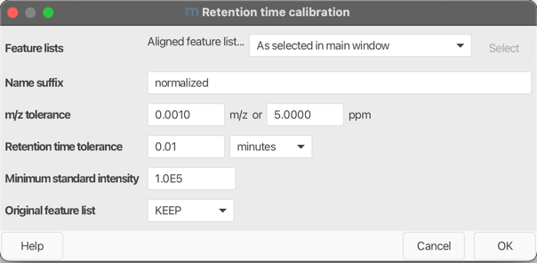

# Retention time calibration

## Description

:material-menu-open: Feature list methods → Normalization → Retention time calibration

The retention time calibration module attempts to reduce the deviation of retention times between feature lists, by searching for common features in these feature lists and using them as calibration standards.

This process involves identifying standard features, calculating their average RTs, and adjusting the RTs of other features based on these standards. The RT correction value will be added to each feature.

## Identifying calibration standards
Calibration standards are features that:

- Meet a minimum intensity threshold.
- Are present in all feature lists.
- Fall within specified m/z and RT tolerances.

## Averaging RTs of calibration standards
RTs of identified calibration standards are averaged. The averaged RT is set as RT for the calibration standard features across all samples.

## Correcting retention times
The correction of RTs is performed based on the relationship between the original RTs of features and the RTs of the calibration standards. The following cases describe how the corrected RTs are calculated:

### Case 1: Feature is a calibration standard
The RT for this feature is set to its averaged RT calculated from all samples.

### Case 2: Feature between two calibration standards
For features that are not calibration standards and fall between the RTs of two identified calibration standards:

The corrected RT is calculated by linear interpolation between the closest previous and next standards. 

For a feature \( F \) with an original retention time \( RT_F \), situated between two standards \( S_{\text{prev}} \) and \( S_{\text{next}} \) with original retention times \( RT_{\text{prev}} \) and \( RT_{\text{next}} \), and normalized retention times \( \text{RT}_{\text{prev, norm}} \) and \( \text{RT}_{\text{next, norm}} \):

1. **Calculate the weight**:
   \[
   \text{weight} = \frac{RT_F - RT_{\text{prev}}}{RT_{\text{next}} - RT_{\text{prev}}}
   \]

2. **Calculate the corrected RT**:
   \[
   RT_{F, \text{cor}} = RT_{\text{prev, cor}} + \text{weight} \times (RT_{\text{next, cor}} - RT_{\text{prev, cor}})
   \]
#### Explanation
- **Weight**: Represents the relative position of feature \( F \) between the two standards \( S_{\text{prev}} \) and \( S_{\text{next}} \).
- **Corrected RT**: Computed by linearly interpolating between the corrected RTs of the two surrounding calibration standards, weighted by the relative position of \( F \).

### Case 3: Only One Standard
   If only one calibration standard is identified:

   The corrected RT is adjusted by adding the difference between the original RT of the standard and its averaged RT to the original RT of the feature.

:warning: The method requires at least two resolved (for example, [Local minimum resolver](../featdet_resolver_local_minimum/local-minimum-resolver.md)) feature lists. This step needs to be performed before alignment.

## Parameters

#### Name suffix

Suffix to be added to a processed feature list name

#### m/z tolerance

Maximum allowed m/z difference for two values to be considered the same

#### Retention time tolerance

Maximum allowed difference between two retention time values

#### Minimum standard intensity

Minimum height of a feature to be selected as calibration standard

#### Original feature list

If REMOVE option is selected, the original feature list is  removed, allowing to save memory.

{{ git_page_authors }}

