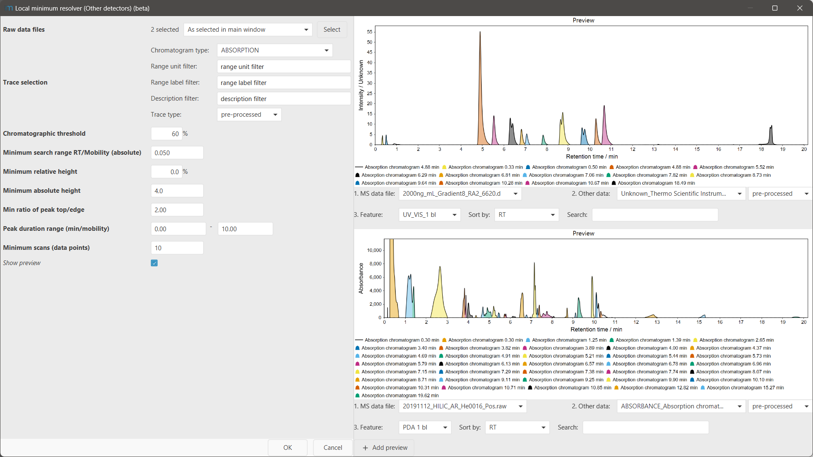

# Local minimum resolver (Other data)

The resolver detects individual chromatographic peaks in a trace and resolves them into individual
features (see [trace types](../otherdetector_glossary.md#trace-type)).

At the same time, the area percentage is calculated in reference to
the [preprocessed trace](../otherdetector_glossary.md#preprocessed-trace).

## Parameters

#### Chromatographic threshold

This filter assumes that most of the data points contain no signals to remove unnecessary noise.

Specify the percentage of data points in the trace to be removed before local minima search. This
represents an important filter for noisy chromatogram and significantly reduces the processing time.
The algorithm finds the intensity value (threshold) that leaves the specified percentage of data
points in the trace below the given value. All such data points are removed.

The typical values for data from other detectors may be significantly different than from MS data.
E.g., MS data may require 85%, whereas other data may require lower values such as 50%.

#### Minimum search range

Size of the RT window examined for local minimum search. An overly narrow search range can cause
peak edges to be cut off, whereas a too wide search ranges might lead to an incomplete resolution of
narrowly eluting peaks (see example below).

#### Minimum absolute height

Minimum absolute intensity a peak needs to reach to be retained as a feature.

#### Minimum relative height

Minimum relative intensity (with respect to the highest data point in the trace) a peak needs to
reach to be retained as a feature. This parameter can be used in combination with the **Minimum
absolute height** setting as to filter the resolved features to be retained.

#### Min ratio of peak top/edge

Minimum ratio between the intensity of the highest (apex) and side (left and right 'edges') points
of a peak, to retain it as a feature. The peak edges have to be X times less intense than the peak
apex for the feature to be retained.

:material-lightbulb: This parameter can best be optimized using the _Show preview_ option. We
recommend values between 1.7 (not baseline separated) and 2 to start the optimisation.

#### Peak duration range

Range of acceptable peak length expressed in minutes (RT dimension). This parameter can be used to
filter out noisy features based on their overly short (or long) duration.

#### Minimum scans (data points)

Minimum number of data points a resolved peak needs to have to be considered valid and retained as a
feature. This parameter can be used along with the **Peak duration range** setting as peak duration
constraint to filter out noisy features.
