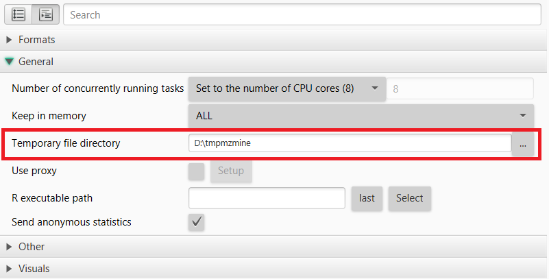

This section contains information on how to tune MZmine 3 for different systems.

## Preferences

The preferences can be changed in MZmine's graphical user interface by accessing _File/Set
preferences_ from the menu. The choices will be stored in a (hidden) _.mzmine3.conf_ file in the
user's home directory (Windows: _C:\Users\USERNAME_) once MZmine is closed.

{: style="width:200px"}

### Temporary files

MZmine will create multiple temporary files at various times of the processing stage, e.g., when
importing spectral data, running mass detection, or creating feature lists. These files will be
stored in a folder that can be specified in the preferences.

We recommend putting this folder on an SSD drive, ideally an M.2 for the best performance. The
temporary files will be deleted when MZmine is closed (Mac & Linux) or when a new session is
started (Windows).

{: style="width:500px"}

### Memory options

{: style="width:500px"}

The parameter **Keep in Memory** defines what data is kept in memory (RAM) or otherwise memory
mapped to the temp directory.

- Generally this setting should be _none_ (**default**).
- If memory is no issue this option might be set to _all_
  process all spectral and feature data in memory.
- The option _masses_features_ keeps centroid mass lists and features in memory while memory mapping
  raw spectral data.
- The option _mass_lists_ will keep only mass lists in RAM, while memory mapping the raw spectral
  data and features.

## Logs

Currently, the logs are written to an _mzmine_0_0.log_ file in the user's home directory. Please
submit your log files together with any issues
on **[GitHub](https://github.com/mzmine/mzmine3/issues)**.

## Maximum memory
The maximum Java heap size (the main part of the RAM available to MZmine) is set to 80%. This is usually a good value, considering that MZmine and its Java Virtual Machine (JVM) will use memory extending over this 80% threshold for specific tasks. There is one way to change the maximum heap size before starting MZmine, however, it requires administrator access.

Find the **MZmine/app/MZmine.cfg** file in the MZmine install directory or portable version. Under Window, this file is write protected, which needs to be changed under **File/Properties/Security/** select Users and click Edit to grant write access. Now change the _MaxRAMPercentage_ to grant more RAM.
```
java-options=-XX:InitialRAMPercentage=10
java-options=-XX:MaxRAMPercentage=80
```
