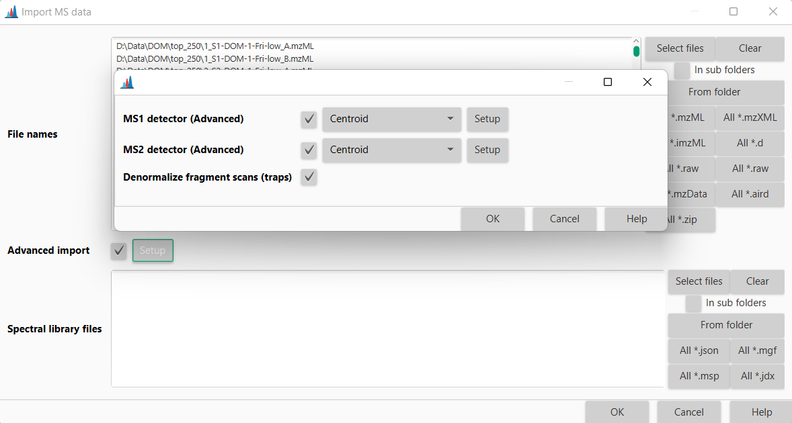
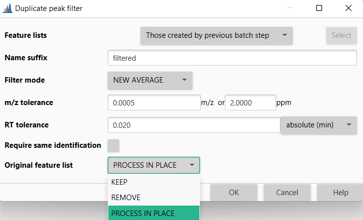

# General remarks
This section contains information on how to tune MZmine 3 for different systems. Generally these points can improve the throughput and memory constraints:

- Make sure to set the **temporary** files directory to a **fast local drive**, e.g., SSD
- [Convert files](data_conversion.md) to centroided open formats, e.g., mzML 
- Run MZmine in **headless mode** as a [command-line tool](commandline_tool.md) to avoid the graphical-user interface (GUI). Just provide a batch file and process on any computer or server.
- Use the **advance data import** to reduce the amount of data that needs to be loaded. This will apply mass detection during the import.
- Optimize your MZmine workflow in the batch mode, cosidering your data and study design:
    - Increase minimum feature height, noise levels, and other feature constraints. If a feature was detected in at least one sample - gap-filling will try to fill the gaps of missed features later.
    - Use **Join aligner** and **Peak finder (multi-threaded)** gap-filling for large datasets as they are optimized
    - Apply **Rows filter** between alignment and gap-filling with a minimum number of samples filter: "How many samples do I need for a significant feature?"
    - Set all **Handling orgininal feature lists** parameters to *PROCESS IN PLACE* or *REMOVE*
- Upgrade the **RAM** of your system or run on a server


## Tuning modules

### Advanced data import
The advanced data import provides the option to apply mass detection during import and only 
loading those filtered mass spectra. This is a great way to reduce the need for memory 
mapping of raw spectra that are not used in most workflows (most use the masslists detected 
by Mass detection step as a filtered centroid version of spectra). This option is great for large datasets and for profile mode data. 

1. Open the Import MS data parameters
2. Activate Advanced import and press Setup
3. Define the MS1 and MS2 detectors as described in the Mass detection step
4. Remove all other Mass detection steps from the batch configuration, usually applied after data import




### Handling orgininal feature lists
Most processing steps in MZmine create new feature lists and have options to handle the orgininal lists. 
- KEEP: Use during optimization of the workflow. All feature lists are kept for comparison purposes and to backtrack issues.
- REMOVE: Remove the original feature lists. Better for performance and memory constraints on large datasets.
- PROCESS IN PLACE: Only available for some modules like the duplicate filter or the rows filter. Even better performance then REMOVE. 

{: style="width:400px"}


## Preferences

The preferences can be changed in MZmine's graphical user interface by accessing _File/Set
preferences_ from the menu. The choices will be stored in a (hidden) _.mzmine3.conf_ file in the
user's home directory (Windows: _C:\Users\USERNAME_) once MZmine is closed.

{: style="width:200px"}

### Temporary files

MZmine will create multiple temporary files at various times of the processing stage, e.g., when
importing spectral data, running mass detection, or creating feature lists. These files will be
stored in a folder that can be specified in the preferences.

We recommend putting this folder on an SSD drive, ideally an M.2 for the best performance. The
temporary files will be deleted when MZmine is closed (Mac & Linux) or when a new session is
started (Windows).

{: style="width:500px"}

### Memory options

{: style="width:500px"}

The parameter **Keep in Memory** defines what data is kept in memory (RAM) or otherwise memory
mapped to the temp directory.

- Generally this setting should be _none_ (**default**).
- If memory is no issue this option might be set to _all_
  process all spectral and feature data in memory.
- The option _masses_features_ keeps centroid mass lists and features in memory while memory mapping
  raw spectral data.
- The option _mass_lists_ will keep only mass lists in RAM, while memory mapping the raw spectral
  data and features.

## Logs

Currently, the logs are written to an _mzmine_0_0.log_ file in the user's home directory. Please
submit your log files together with any issues
on **[GitHub](https://github.com/mzmine/mzmine3/issues)**.

## Maximum memory
The maximum Java heap size (the main part of the RAM available to MZmine) is set to 80%. This is usually a good value, considering that MZmine and its Java Virtual Machine (JVM) will use memory extending over this 80% threshold for specific tasks. There is one way to change the maximum heap size before starting MZmine, however, it requires administrator access.

Find the **MZmine/app/MZmine.cfg** file in the MZmine install directory or portable version. Under Window, this file is write protected, which needs to be changed under **File/Properties/Security/** select Users and click Edit to grant write access. Now change the _MaxRAMPercentage_ to grant more RAM.
```
java-options=-XX:InitialRAMPercentage=10
java-options=-XX:MaxRAMPercentage=80
```

{{ git_page_authors }}
