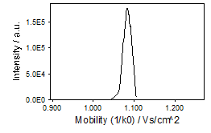

# Ion mobility spectrometry terminology

Since ion mobility spectrometry (IMS) resolved data is more complex due to the additional dimension
when compared to regular LC-MS data, some terms shall be clarified before going into details of the
processing steps.

## Background
Ion-mobility mass-spectrometry, here simply referred to as ion-mobility (IM), [...].
IM separation is normally performed on a millisecond timescale by modern devices. Thus, it nicely fits in-between LC separation (~seconds timescale) and MS detection of TOF instruments (~microseconds timescale). This allows LC-IM-MS insturments to acqurie several MS spectra during each [accumulation](#frames-and-mobility-scans), without incurring sensitivity loss. For example, assuming a typical 100 µs MS-acquisition time of QTOF instruments, up to 1000 spectra can be recorded within 100 ms of IM separation. Therefore, as opposed to LC-MS, multiple MS (or MS2) spectra are associated to a each RT in LC-IM-MS data. A more detailed explanation of LC-MS and LC-IMS-MS raw data structure is provided [here](lc-ms-and-lc-ims-ms-data-comparison.md).

## Terminology

### Frames and Mobility Scans
During one IMS accumulation and separation, multiple mass spectra are acquired to resolve the
mobility dimension. All mass spectra acquired during one mobility separation are termed "_mobility
scans_" in MZmine. The agglomerate of all mobility scans for one IMS accumulation are called
"_frame_". All _mobility scans_ of a single _frame_ can be summed, to represent a single mass
spectrum as in classic LC-MS.

### Mobilograms

A "_mobilogram_" represents the intensity of an m/z or m/z range along the mobility axis. A
_mobilogram_ may be build from multiple frames and summed or built from a single frame.

### Ion mobility trace

An "_ion mobility trace_" basically represents a mobility resolved extracted ion chromatogram (EIC).

### Cross Collisional Section
IM-derived CCS values can be used as an additional molecular descriptor to support the compound unknown identification process.(Paglia et al. 2014) However, the number of acquired spectra per run increases from several thousand to several million, requiring memory-efficient software and new processing algorithms. 

## References
https://doi.org/10.1074/mcp.TIR118.000900
