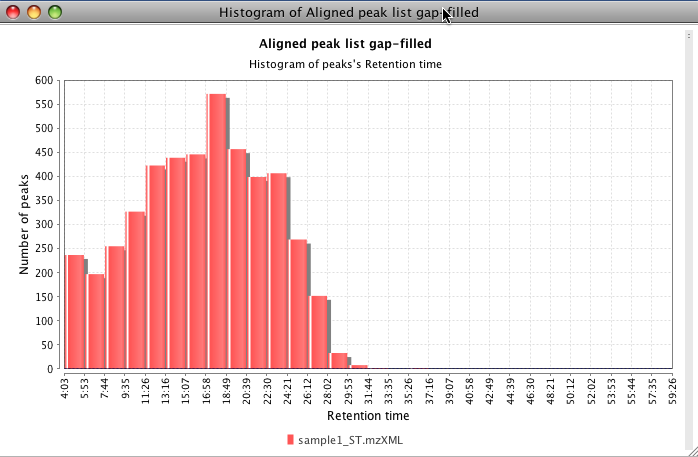

## **Histogram plot**

TODO Change "Histogram" name to "Feature list histogram"

### **Description**

This plot displays a graphic representation of frequencies. Each rectangle represents an interval of frequency. The height is also equal to the frequency density in that interval. The total area of the histogram is equal to the number of data. This tool can use the m/z value, height, area or retention time as frequency value (X axis) and number of peaks in each interval (Y axis).

### **Parameters**

##### **Raw data files**

Column of peaks to be plotted.

##### **Plotted data type**

Peak's data to be plotted ( m/z value, height, area or retention time)

##### **Plotted data range**

Range of data to be plotted. This range is automatically loaded with max values from the raw data.

##### **Number of bins**

The plot is divides into this number of bins.

### **Functionality**

This plot is using the third part library JfreeChart for its basic functionality.

To zoom in, drag the mouse from left to right, selecting the area to zoom. To zoom out drag the zoom from right to left.

The next figure shows a histogram using the retention time value. This data is coming from a raw data with a duration of 60 min. Most of the peaks appears around 17 min.

The next figure shows a histogram using the m/z value. This data is coming from a raw data with a range from 350 to 1400 m/z.

TODO rewrite