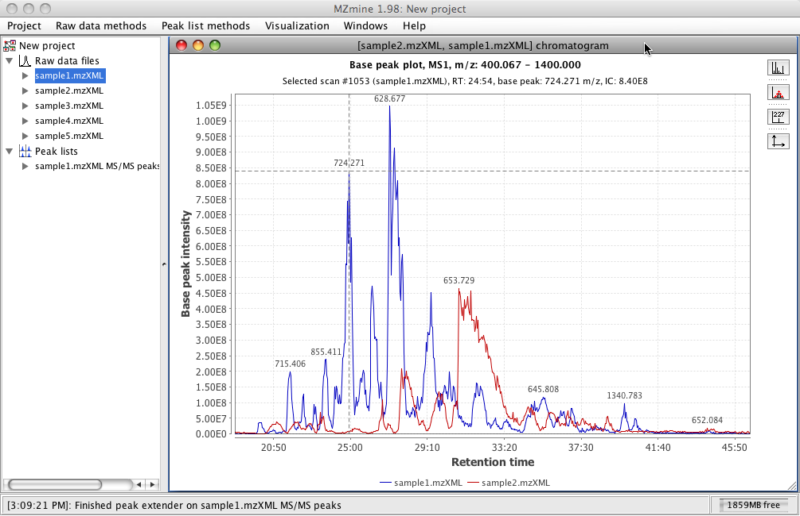
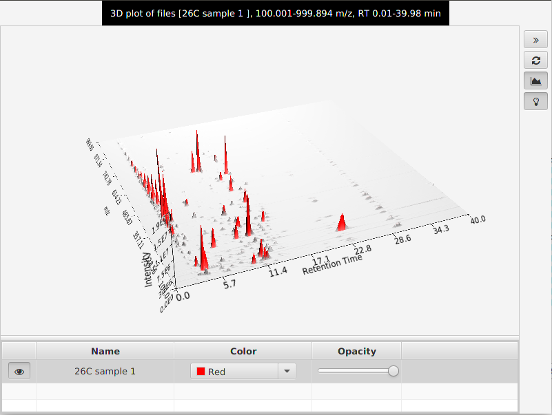

## **Chromatogram plot**

### **Description**

There is a possibility to display chromatographic peaks outside of raw data overview. This standalone two-dimensional plot visualizes TIC/XIC data. All the chromatograms are displayed in the same plot.

The x-axis corresponds to retention time and the y-axis is the intensity level of the signal.

### **Parameters**

**Raw data files**

List of raw data files to display in the TIC visualizer.

**MS level**

Scan level (MS1,MS2,... ,MSn) to display in the plot.

**Plot type**

TIC or base peak

**Retention time**

Retention time (x-axis) range.

**m/z range**

Range of m/z values. If this range does not include the entire scan m/z range, the resulting visualizer is XIC type.

**Selected peaks**

List of chromatographic peaks to display in the TIC visualizer. This option is available only if a peak list related to the selected raw data file exists in the current project.

## **MS spectrum**

Displays all the ions from a selected scan. Can be used to explore mass spectrum outside of raw data overview.
**Only one** raw file can be chosen.

It shows a plot of two dimensions, where X axis corresponds to m/z value and Y axis is the intensity of the ion signal.

### **Parameters**

**Scan number**

Choose the scan to visualize

## **3D visualizer**

### **Description**

This tool presents a three dimensional plot where X axis represents the retention time, Y axis the m/z value and Z axis the intensity of the signal. This plot is the collection of all the information from the raw data in a graphical representation.

### **Parameters**

**MS level**

This refers to the scan level (MS1,MS2,... ,MSn) to be used to display the chromatogram.

**Retention time**

Retention time (X axis) range.

**Retention time resolution**

Number of data points on retention time axis.

**m/z range**

Range of m/z values.

**m/z resolution**

Number of data points on m/z axis.

## **Scan histogram**

### **Description**

This module creates m/z distribution histograms of all m/z values in mass lists across specified scans. The binning width, in which the m/z values are counted, can be changed dynamically. The number of scans that contain a specific m/z value (bin) are plotted.

<https://youtu.be/31hwc74vUjA>

### **Parameters**

**Raw data file, scans filter and mass list**

Specify the scans and mass lists

**m/z range**

Limit the range of the histogram to save performance

**Retention time range (optional)**

Limit the scans to a specific retention time range

**m/z bin width**
The binning width to count m/z value occurance in scans (can be changed dynamically in the dialog)

**The dialog**

The "bin width" and "shift bins by" parameter automatically listens for changes and updates the chart (indicated by red/green label above). 

User can also apply a Gaussian fit to a distribution.

## **Scan inject time analysis**

TODO

## **MS(n) spectra tree

TODO

TODO Describe MS plot window

TODO Decribe chromatogram window
