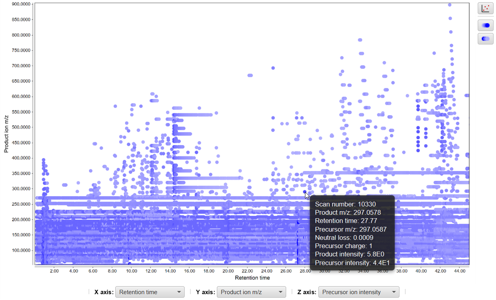

# **MS/MS plot**

## **Description**

:material-menu-open: **Visualization  → MS/MS scatter plot**

This module provides a colored scatter plot of the MS/MS data. There are 4 options for X and Y axes: retention time, precursor ion m/z, product ion m/z, neutral loss and 3 options for Z axis (color): precursor ion intensity, product ion intensity, retention time. The module additionally allows you to filter ions by their intensities and to perform diagnostic fragmentation filtering. In order to focus on the values of interest you can highlight specific data points and sort them by color axis. This tool can be very useful to get an overview of large amounts of MS/MS data by tuning parameters and filters.

## **Parameters**

#### **Raw data file**

Selection of the raw data file to visualize. Only one file can be selected.

#### **X axis**

Selection of the values for X axis. There are 4 options available: Retention time, Precursor ion m/z, Product ion m/z, Neutral loss.

#### **Y axis**

Selection of the values for Y axis. Options are the same as for X axis.

#### **Z axis**

Selection of the vales for Z axis. There are 3 options available: Precursor ion intensity, Product ion intensity, Retention time.

#### **MS level**

MS level of the scans to be plotted.

#### **Retention time**

Retention time range.

#### **m/z range**

Range of m/z values for precursor ions in MSn scans.

#### **m/z tolerance**

Maximum allowed difference between two m/z values to be considered same.

#### **Intensities filtering**

Optional parameter to filter ions by intensity. There are 3 different ways of filtering:

<ul>
    <li>Number of best fragments - Number of ions with highest intensities from each scan to be visualized.
         For example 5(for each scan 5 ions with highest intensities will be plotted).</li>
    <li>Base peak percent, % - Ions with intensity values lower than the given percent of base peak intensity will be plotted.
         For example 95(ions with intensity values lower than 0.95 multiplied by base peak intensity will not be plotted).</li>
    <li>Intensity threshold - Ions having intensities lower than the given value will not be plotted.
         For example 6.0E6(ions with intensity values lower than 6.0E6 will not be plotted).</li>
</ul>

#### **Diagnostic fragmentation filtering**

Optional parameter for diagnostic fragmentation filtering described below. It has 2 subparameters: diagnostic product ions and diagnostic neutral loss values. Scans not containing any ion satisfying each input criterion will not be considered for the visualization.

## **Diagnostic fragmentation filtering**

Due to common structural features, compounds within the same class undergo similar MS/MS fragmentation and as a result of many identical product ions and/or neutral losses. Diagnostic fragmentation filter (product ion filter) is a post-acquisition approach to screen LC-MS/MS datasets for entire classes of both known and unknown natural products. This tool searches all MS/MS spectra for product ions and/or neutral losses that has defined as being diagnostic for the entire class of compounds. In other words it screens LC-MS/MS datasets for MS/MS spectra containing production ions and/or neutral losses that are specific to that class of compounds. The user defines the diagnostic product ions and/or the diagnostic neutral loss values (Da) to use in the filtering.

The user can also define the minimum diagnostic ion intensity (% base peak) to use in the filtering. If a recurrent neutral loss occurs, a line pattern in the plot can be observed. If compounds carrying those diagnostic product ions and/or the neutral loss values are detected the resulting plot will show their product ion m/z and precusor ion m/z. Additionally, an output file may be specified that will output the results of the filtering. For a detailed view of diagnostic fragmentation filtering: [Walsh, Jacob P., et al. "Diagnostic Fragmentation Filtering for the Discovery of New Chaetoglobosins and Cytochalasins." Rapid Communications in Mass Spectrometry (2018)](https://pubmed.ncbi.nlm.nih.gov/30325552/).

## **Functionality**
This plot is using the third part library JfreeChart for its basic functionality.
    <ul>
        <li>Drag the mouse from left to right - selecting the area to zoom</li>
        <li>Drag the mouse from right to left - zoom out</li>
        <li>Select combo boxes below - change axes types</li>
        <li>Hold the mouse on data point - show detailed information in a tooltip</li>
        <li>Double click on data point - show spectrum plot</li>
        <li> - highlight points representing ions with specific values given by input ranges (Note: colors of range input boxes determine the highlighting color, green color denotes ions satisfying both ranges)</li>
        
        <li> - show intense points in front</li>
        
        <li> - show pale points in front</li>
        
    </ul>