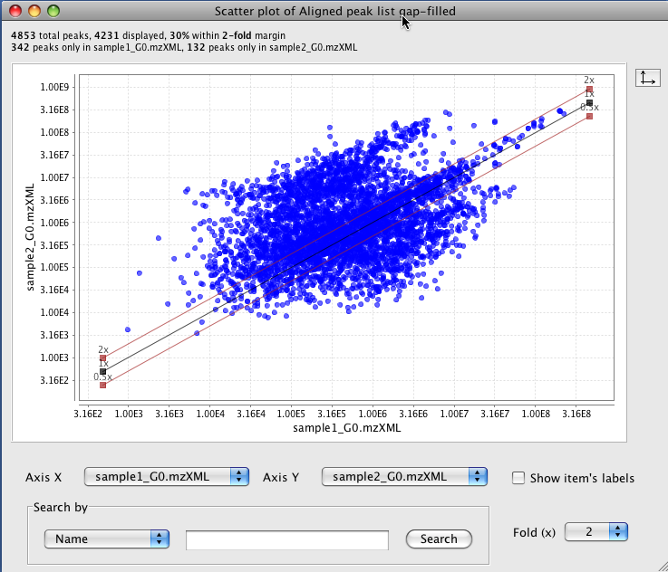

## **Scatter plot**

TODO Rename 

### **Description**

This tool shows a scatter plot with data from identified peaks in aligned feature list.

A search for a peak can be done using three options (name, retention time and m/z value).

## **Correlated features \(\Delta\)m/z histogram**

TODO

## **Feature intensity plot**

### **Description**

TODO

### **Parameters**

**Data files**

Selects the raw data files from where the peaks were detected

**X axis value**

X axis display the raw data file name or the parameter defined in the "set sample parameters" window

**X axis value**

The user can choose from peak's height, area or retention time value to display in this axis.

**Peaks**

The user can select the peaks to use in this plot.

## **Kendrick mass plot**

### **Description**

If you use this module for your analysis or visualization, please cite:

*Three‐dimensional Kendrick mass plots as a tool for graphical lipid identification. A. Korf, C. Vosse, R. Schmid, P. O. Helmer, V. Jeck, H. Hayen, Rapid Communications in Mass Spectrometry 32.12 (2018): 981-991.*

### **Parameters**

**Peak list** 

Select the targeted peak list.

**Peaks**

Add peaks from the peak list.

**Kendrick mass base for y-Axis**

Enter a sum formula which will be used as Kendrick mass base for the y-Axis.

**X-axis value**

Select which parameters you want to display on the X-Axis (Kendrick mass (KM) or m/z).

**Kendrick mass base for x-Axis**

If you want to display a Kendrick mass defect on the x-axis, check the check box and enter a sum formula as Kendrick mass base.

**Z-axis value**

Select which parameters you want to display in the third dimension. If you select "none", a 2D Kendrick mass plot will be generated.

**Kendrick mass base for Z-Axis**

If you want to display a Kendrick mass defect on the z-axis in form of a heatmap, check the check box and enter a sum formula as Kendrick mass base.

**Z-axis scale value**

Choose the bounds for the Z-axis. "Percentile" allows to exclude values of a selected percentile bellow and/or above from the paint scale. Values below will be displayed in black, values above will be displayed in magenta. "Custom" allows to set custom ranges.

**Range for z-axis scale**

Enter lower bound left and higher bound right. If you have choosen percentile for Z-axis scale the values must be between 0 and 100. If you enter 0 and 100, all values will be included in the paint scale.

**Heatmap style**

Select the style of your paint scale. You can choose between rainbow and different monochrome color coded paint scales.

### **Background**

In 1963 Kendrick published his idea of a mass scale, the so-called Kendrick mass scale, which is based on defining the mass of CH2 as 14.0000 u.

The Kendrick mass scale is calculated by multiplying the IUPAC mass scale with the factor 14.0000 u/14.01565 u = 0.9988834. This results in the same mass defect for homologous components, the so-called **Kendrick mass defect (KMD)**. The KMD is defined as the \(\Delta\) of a nominal Kendrick mass and its associated Kendrick mass. Using the Kendrick mass scale has the purpose of data reduction. 

\[KM(R)=m/z\cdot\frac{round(R)}{R}\]

\[KMD(R)=round(KM(R))-KM(R)\]

where \(KM\) is Kendrick mass, \(KMD\) - Kendrick mass defect, \(R\) - exact mass of selected base unit

More information: <https://en.wikipedia.org/wiki/Kendrick_mass>

### **Functionality**

This module allows to create 2 and 3 dimensional Kendrick mass plots. All possible feature characteristics can be plotted in a third dimension.

**Charge dependent Kendrick mass plots**

Multiply charged ions can cause splits in Kendrick mass plot. Fouquet et al. have shown considering the charge for the calculation of the KM can help to overcome this problem through clustering of features.

\[KM(R,Z)=Z\cdot KM(R)=Z\cdot m/z\cdot \frac{round(R)}{R}\]

where \(Z\) is charge.

*Fouquet, Thierry NJ, et al. "On the Kendrick Mass Defect Plots of Multiply Charged Polymer Ions: Splits, Misalignments, and How to Correct Them." Journal of The American Society for Mass Spectrometry 29.8 (2018): 1611-1626.*

**Resolution enhanced Kendrick mass defect plots**

Fouquet and Sato have shown that a fractional base unit (ivisor) can enhance the resolution of Kendrick mass plots.

\[X>1, KM(R,X)=m/z\cdot \frac{round(R/X)}{R/X}\]

where \(X\) is a fractional base unit.

*Fouquet, Thierry, and Hiroaki Sato. "Extension of the Kendrick mass defect analysis of homopolymers to low resolution and high mass range mass spectra using fractional base units." Analytical chemistry 89.5 (2017): 2682-2686.*

**Combining charge and fractional base unit (Divisor)**

If both charge and fractional base unit are changed, the following equation is used:

\[KM(R,Z,X)=Z\cdot KM(RX)=Z\cdot m/z\cdot \frac{round(R/X)}{R/X}\]

*Fouquet, Thierry NJ, et al. "On the Kendrick Mass Defect Plots of Multiply Charged Polymer Ions: Splits, Misalignments, and How to Correct Them." Journal of The American Society for Mass Spectrometry 29.8 (2018): 1611-1626.*

*Fouquet, Thierry, Takaya Satoh, and Hiroaki Sato. "First gut instincts are always right: the resolution required for a mass defect analysis of polymer ions can be as low as oligomeric." Analytical chemistry 90.4 (2018): 2404-2408.*
**Remainders of Kendrick masses (RKM)**

Another option to increase the resolution of Kendrick mass plots is the by Fouquet et al. proposed concept of RKM (remainders of Kendrick masses). By clicking the KMD/RKM button in the toolbar on the right side, KMDs are transformed to RKMs.

\[RKM(R)=\Bigg\{\frac{KM(R)}{round(R)}\Bigg\}\]

with \(\{ \}\) being the fractional part function defined as \(x=x-floor(x)\)