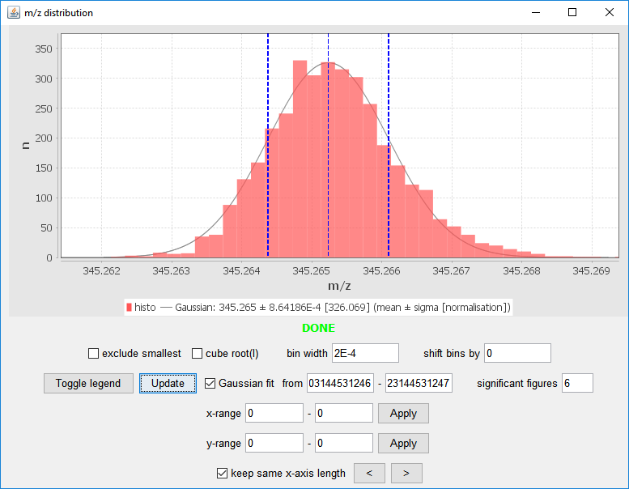

## **Chromatogram plot**

### **Description**

:material-menu-open: **Visualization → Chromatogram plot**

There is a possibility to display chromatographic peaks outside of raw data overview. This standalone two-dimensional plot visualizes TIC/XIC data. All the chromatograms are displayed in the same plot.

The x-axis corresponds to retention time and the y-axis is the intensity level of the signal.

### **Parameters**

#### **Raw data files**

List of raw data files to display in the TIC visualizer.

#### **MS level**

Scan level (MS1,MS2,... ,MSn) to display in the plot.

#### **Plot type**

TIC or base peak

#### **Retention time**

Retention time (x-axis) range.

#### **m/z range**

Range of m/z values. If this range does not include the entire scan m/z range, the resulting visualizer is XIC type.

#### **Selected peaks**

List of chromatographic peaks to display in the TIC visualizer. This option is available only if a peak list related to the selected raw data file exists in the current project.

## **MS spectrum**

:material-menu-open: **Visualization → MS spectrum**

Displays all the ions from a selected scan. Can be used to explore mass spectrum outside of raw data overview.
**Only one** raw file can be chosen.

It shows a plot of two dimensions, where X axis corresponds to m/z value and Y axis is the intensity of the ion signal.

### **Parameters**

#### **Scan number**

Choose the scan to visualize

## **2D visualizer**

:material-menu-open: **Visualization → 2D plot**

This tool displays a plot of two dimensions, where X axis corresponds to retention time and Y axis is the m/z value. This visualization of spots in the plot corresponds with the intensity of the data in that region.

:material-lightbulb: User can define features from the feature list to be displayed on the plot.

### **Parameters**

#### **Type of data**

This plot can use either resampled data as input (faster), or raw data (slower).

#### **Scans**

Here user can set up the level (MS1,MS2,... ,MSn), polarity, retention time, and the other parameters of the scans to be used.

#### **m/z** 

Defines range of m/z values. 

[//]: # (TODO Look into the code for this - If this range does not include the whole scan m/z range, the resulting visualizer is XIC type.)

## **3D visualizer**

### **Description**

:material-menu-open: **Visualization → 3D plot**

This tool presents a three dimensional plot where X axis represents the retention time, Y axis the m/z value and Z axis the intensity of the signal. This plot is the collection of all the information from the raw data in a graphical representation.

### **Parameters**

#### **Scans**

Here user can set up the level (MS1,MS2,... ,MSn), polarity, retention time, and the other parameters of the scans to be used.

#### **m/z range**

Range of m/z values.

#### **Features**

Features that will be taken as an input.

#### **Retention time resolution**

Number of data points on retention time axis.

#### **m/z resolution**

Number of data points on m/z axis.

## **Scan histogram**

### **Description**

:material-menu-open: **Visualization → Scan histogram**

This module creates m/z distribution histograms of all m/z values in mass lists across specified scans. The binning width, in which the m/z values are counted, can be changed dynamically. The number of scans that contain a specific m/z value (bin) are plotted.

[//]: # (TODO Maybe change the picture)

<https://youtu.be/31hwc74vUjA>

### **Parameters**

#### **Scans**

Here user can set up the level (MS1,MS2,... ,MSn), polarity, retention time, and the other parameters of the scans to be used.

#### **m/z**

Limit the range of the histogram (can improve performance).

#### **Signal intensity range**

_Optional parameter_

Allows to limit signal intensities (can improve performance).

#### **Mass defect**

_Optional parameter_

Filters for mass defects in the signals.

#### **Type**

Type of the histogram to be created. Available options:

- m/z,
- Intensity,
- Intensity (noise recalibrated),
- Mass defect.

#### **Bin width**

The binning width to count m/z value occurence in scans.

#### **Use mobility scans**

If the input data has ion mobility dimension, this data can be used instead of the data from the summed frames.

## **Scan inject time analysis**

[//]: # (TODO)

## **MS(n) spectra tree**

[//]: # (TODO)

[//]: # (TODO Describe MS plot window)

[//]: # (TODO Decribe chromatogram window)

[//]: # (TODO 2D plot//)