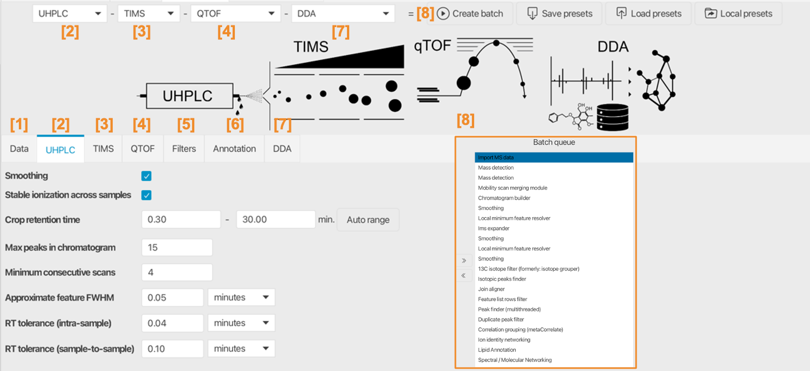
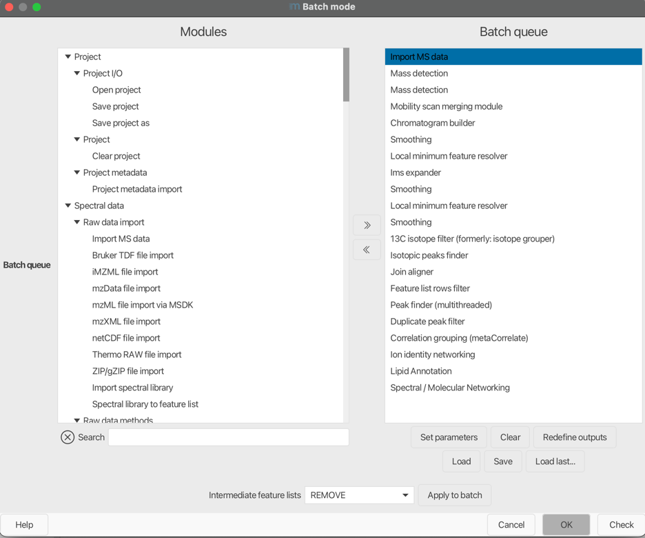

# Processing wizard

The processing wizard reduces the configuration of complex standardized workflows into few parameters. Those values are used to estimate or calculate all other parameters from spectral processing over feature detection and alignment to annotation and data export. More wizards are planned for specialized workflows and analytical methods. Feel free to reach out if your workflow might be a candidate for a wizard setup.

:material-menu-open: **Processing wizard** 

!!! tip
    The wizard is split into two sections: The MS part and the chromatography part. Parameters here reflect the sensitivity, resolution, and accuracy of these parts of the hyphenation. Selecting one of the default presets and clicking **Set defaults** actually populates the initial values. 

!!! danger
    The defaults are only suggestions and different acquisition methods and instruments produce different noise levels etc. The **raw data overview** and **aligned feature lists** are useful to optimize these results.

## Parameters section

Produces this batch:

#### MS1/MS2 noise levels
Separate noise levels to threshold spectra of MS level 1 and 2 (or above). So the MS2 noise level is used for MSn data with level > 1. These parameters can be optimized by looking at the spectral raw data in the raw data overview.

#### Minimum feature height
The minimum height of chromatograms and features

#### Scan to scan m/z tolerance
Relative and absolute m/z tolerance. Always applies the maximum tolerance based on the m/z this means that smaller and higher values are stronger affected by the absolute and relative tolerance, respectively. 
Used to find the same signal in different scans when connecting chromatigrams. Reflects on the mass accuracy between scans in the same raw data file.

#### Feature to feature m/z tolerance
Relative and absolute m/z tolerance. Always applies the maximum tolerance based on the m/z this means that smaller and higher values are stronger affected by the absolute and relative tolerance, respectively. 
Used to group isotopes and adducts of the same molecule. Those m/z values are already averaged over their features and should have lower m/z differences that the scan to scan tolerance.

#### Sample to sample m/z tolerance
Relative and absolute m/z tolerance. Always applies the maximum tolerance based on the m/z this means that smaller and higher values are stronger affected by the absolute and relative tolerance, respectively. 
Used to align features across samples. Those m/z values are already averaged over their features but originate from differnt samples.

#### MS data files
Select all MS data files to import and process.

#### Spectral libraries
Select all spectral libraries to import and use during spectral library matching to annotate compounds in the final aligned feature list. 

#### Stable ionization across samples
Used during feature grouping of adducts and other ions of the same molecule. Only use if matrix (e.g., salt) contents and ionization efficiencies are comparable across the whole study.

#### Crop retention time
Crops the chromatograms at these retention time values. Useful to cut off the start and the end of the chromatograms. The start is often diverted into the waist and the end often contains the cleanup procedure.

#### Max peaks in chromatogram
An estimate of the number of isomers and isobaric ions in the chromatograms. Used to estimate the percentage of data points that hold useful data for the feature resolving step. (Chromatographic threshold in local minimum resolver).

#### Min samples per aligned feature
Only keep aligned features that were detected in at least n samples. This parameter should usually scale with the sampleset size and if samples are relatively similar from their compounds.

#### Min number of data points
Only keep chromatograms and features with at least 5 data points in retention time dimension.  

#### Approximate feature FWHM
The full-width at half maximum of peaks in retention time dimension. Best extracted from the feature tables of already processed test datasets or from the raw data overview.

#### Intra-sample RT tolerance
Retention time tolerance to group adducts and isotopes of the same molecule. The comparison is performed within each individual sample, usaully leading to small variance.

#### Inter-sample RT tolerance
Retention time tolerance to align features across all samples. Dependent on retention time shifts.

#### Only keep features with 13C 
Detect isotope pattern and only keep feature with valid 13C isotope pattern. 

#### Original feature list
Options to either _keep_ or _remove_ the original feature lists. _Keep_ is valuable during workflow optimization whereas _remove_ saves resources and allows for more performant processing or large datasets. (See section on performance).

#### Export path
The export path configures multiple export modules for GNPS and SIRIUS for data exchange. 

{{ git_page_authors }}