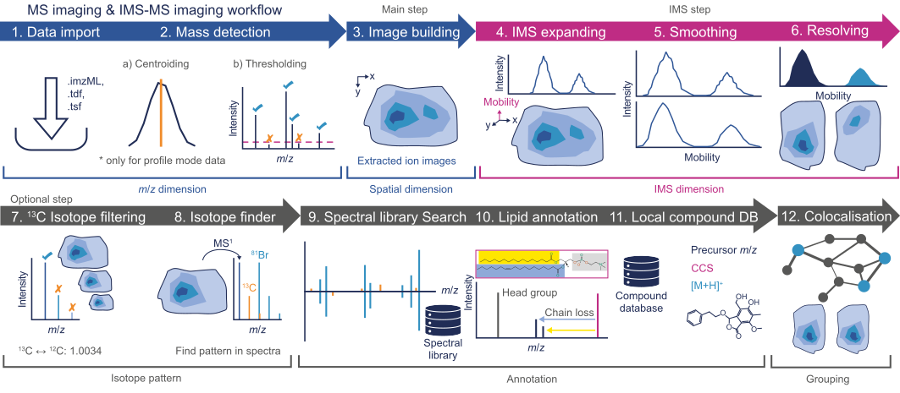

# Imaging Workflow

This page describes the MZmine workflow for non targeted feature detection in imaging datasets. The
workflow is designed for MS imaging data and tested with matrix-assisted laser
desorption/ionisation (MALDI)-MS data.

## Supported data formats

This workflow requires the spatial coordinates to be provided in the raw data file, which is the
case in for the open-source imzML format. The native Bruker .d folders (with .tsf and .tdf data
files) are also supported. Please note that ion mobility spectrometry (IMS) only supported in the
native Bruker (tdf) format and not supported in imzML data.

## Procedure overview

The general procedure is similar to the [LC-MS workflow](../lcmsworkflow/lcms-workflow.md).
The raw data is imported and noise is
removed ([raw data processing](#raw-data-import-and-processing)) prior
to [feature detection](#feature-detection). Afterwards, multiple [filters](#feature-filtering) are
available to refine the data.

## Raw data import and processing

Raw data is imported by a simple drag-and-drop gesture to the MS data files tab in the main window (
see [Raw data import](../../module_docs/io/data-import.md). After the data import, noise must be
filtered from the raw data via
the [Mass detection](../../module_docs/featdet_mass_detection/mass-detection.md) module. Please not
that this heavily impacts the performance of the whole workflow, since imaging spectra are usually
richer in information than LC-MS spectra. If you experience performance (e.g., RAM issues), consider
using a higher cutoff. IMS-MS imaging data sets require mass detection on
the [Frame](../../terminology/ion-mobility-terminology.md#accumulations-mobility-scans-and-frames)
and [mobility scan](../../terminology/ion-mobility-terminology.md#accumulations-mobility-scans-and-frames)
level.

## Feature detection

After mass detection, the feature detection is performed by
the [Image builder](../../module_docs/imaging_featdet/featdet_image_builder/image-builder.md).

When working with IMS-MS imaging datasets, the ion mobility dimension should be added by
the [IMS expander](../../module_docs/lc-ims-ms_featdet/featdet_ims_expander/ims-expander.md)
subsequent to the image detection. After expanding, the IMS dimension must
be [resolved](../../module_docs/featdet_resolver_local_minimum/local-minimum-resolver.md#resolving-the-ion-mobility-dimension).

## LC-Image aligner

If an LC-MS dataset was acquired for the imaging sample, the results can be aligned using
the [LC-Image Aligner](../../module_docs/align_lc-image/align_lc-image.md). This allows integration
of the two datasets and can be used for more confident identifications in imaging experiments. (
see https://www.nature.com/articles/s41587-023-01690-2)

## Feature filtering

After feature detection, the ion image features can be filtered to refine the results, for example
by the [Feature filter](../../module_docs/feature_filter/feature_filter.md) or
the [Rows filter](../../module_docs/feature_list_row_filter/feature_list_rows_filter.md). Additional
filters are found in the  :material-menu-open: **Feature list methods → Feature filtering** menu.
When using the deisotoping modules, consider that there is no chromatographic separation.

{{ git_page_authors }}
