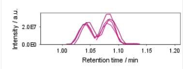

# Workflow optimization

## General remarks for mzmine workflow optimization

The mzwizard builds modular workflows, so-called "batches", made up of individual steps. Each step
applies to the results of the previous step. If your results do not contain e.g. specific features
you were expecting, you have to pinpoint which step omits the expected feature(s).

!!! info
   We recommend to apply the optimization to a representative subset of your dataset. A good starting
   point are usually pooled QC or other representative samples.

### Making your workflow "optimization ready"

To pinpoint which steps need to be optimized, you must first keep the **intermediate results** of
each step.

Do either:

1. In the wizard: in the [mzwizard](../../wizard.md#5-filters) tab, set
   the [Original feature lists](../../wizard.md#original-feature-list) option to "Keep".
2. In the [batch window](../batch_processing/batch-processing.md#how-to-run-batch-processing): Set
   the "Intermediate feature lists" to "Keep" and press "Apply to batch".

### Is my benchmark feature in the feature list?

To quickly assess if a specific feature is in your feature list, you can use
the [Feature list filters](../../module_docs/lc-ms_featdet/featdet_results/featdet_results.md#feature-list-filters)
in the feature table. Enter a specific m/z, or m/z range and/or RT or RT range to search.

### Determine which step to optimize

To determine which step you need to optimize, check the name of the first feature list, that does
not contain your benchmark feature anymore. For example, we may have two feature lists called
"_171103_PMA_TK_QC_03.mzML eics sm_" and "_171103_PMA_TK_QC_03.mzML eics sm r_". The former still
contains our benchmark feature, while the latter does not.

Most processing steps create a new feature list and append a suffix to the name of the previous
feature list. These suffixes may be user-defined, but the wizard uses suffixes that refer to the
name of the individual steps. (Set in the "Suffix" or "Name suffix" parameters in each module)

In our example, the latest suffix is "_r_", which refers to
the [Local minimum resolver](../../module_docs/featdet_resolver_local_minimum/local-minimum-resolver.md).
This means that our benchmark feature is lost in this step.

### Where do I optimize the workflow?

Since we have now pinpointed the problematic step, we can now optimize it using either the wizard 
or the batch mode.

It must be noted that you can optimize every step in the batch mode, but not in the wizard, since 
the wizard gives access to a subset of parameters and provides reasonable defaults for others. 
Where possible, this document will detail approaches to optimize the step using the wizard and the 
individual steps.

While the wizard does not offer insight into the effect of adapted parameters without running it,
the optimization of individual steps in the batch mode does offer previews.

!!! danger
   Optimizing the created batch only affects the specific batch you are currently working on. If you
   close the batch dialog and create a new batch using "Create batch" in the wizard, previous 
   batch optimizations are overridden. We recommend saving the optimized batch file, or saving 
   presets (since mzmine 4.7.29) for the optimized modules, so you can apply the module preset to 
   new batches.

## Common optimizations

### Coeluting features not split
**Problem**: Some features have show coelution with isomers and/or isobars.

**Note**: This may have different causes. Either the expected peak width was too high, or the 
wizard's default resolution setting is too high.

**Solution 1**: Reducing the expected peak width.
- In the wizard: Reduce the "[Approximate feature FWHM](../../wizard.md#approximate-feature-fwhm)" in the HPLC/UHPLC/HILIC tab.
- In the batch: Reduce the [Minimum search range](../../module_docs/featdet_resolver_local_minimum/local-minimum-resolver.md#minimum-search-range-rtmobility-absolute) in the [Local minimum resolver](../../module_docs/featdet_resolver_local_minimum/local-minimum-resolver.md)

**Solution 2**: Reducing the expected peak resolution. (if Solution 1 does not achieve the expected result)
- In the wizard: Not possible
- In the batch: Reduce the [Min ratio of peak top/edge](../../module_docs/featdet_resolver_local_minimum/local-minimum-resolver.md#min-ratio-of-peak-topedge) in the [Local minimum resolver](../../module_docs/featdet_resolver_local_minimum/local-minimum-resolver.md)

**Note**: Optimization of peak resolution is a crucial step. If parameters are chosen too loosely, 
the quality of the peak detection may be reduced severely.

### Feature not detected
**Problem**: A specific feature is not detected in any feature list, even in the most basic one.

**Solution 1**: Reducing the minimum intensity requirements, if the feature is of low intensity.
- In the wizard: Lower the [Minimum feature height](../../wizard.md#minimum-feature-height) in the mass spectrometer tab.
- In the batch: As the wizard parameter influences multiple steps, all these need to be updated:
  - [Chromatogram builder](../../module_docs/lc-ms_featdet/featdet_adap_chromatogram_builder/adap-chromatogram-builder.md#minimum-absolute-height)
  - [Local minimum feature resolver (RT and IMS dimension)](../../module_docs/featdet_resolver_local_minimum/local-minimum-resolver.md#minimum-absolute-height)

**Solution 2**: Reducing the minimum number of data points per feature, if the feature is detected in few consectutive scans.
- In the wizard: Lower the [Minimum consecutive scans](../../wizard.md#minimum-consecutive-scans)
- In the batch: As the wizard parameter influences multiple steps, all these need to be updated:
  - [Chromatogram builder](../../module_docs/lc-ms_featdet/featdet_adap_chromatogram_builder/adap-chromatogram-builder.md#minimum-consecutive-scans)
  - [Local minimum feature resolver (RT and IMS dimension)](../../module_docs/featdet_resolver_local_minimum/local-minimum-resolver.md#min--of-data-points)
